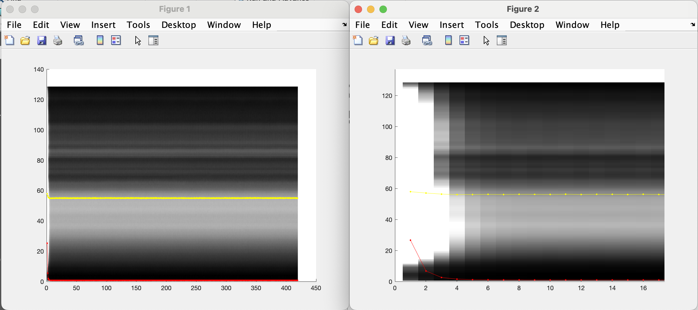
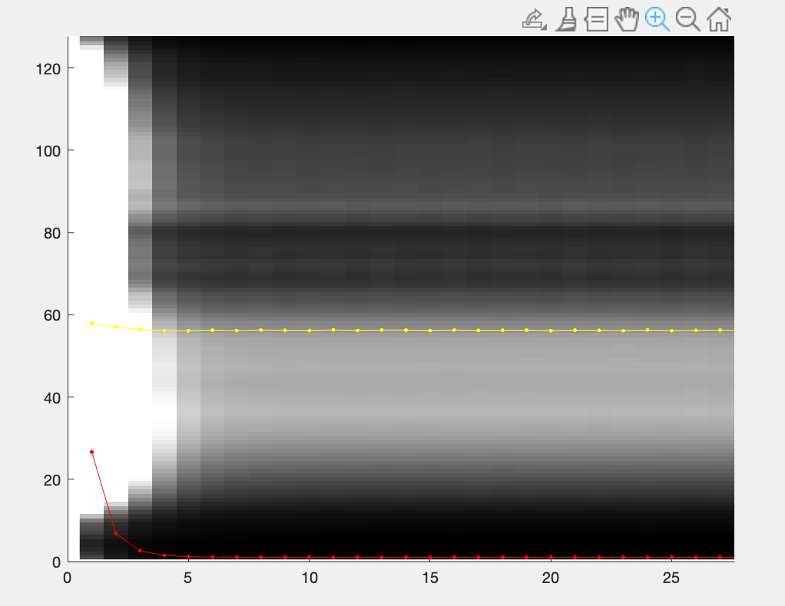
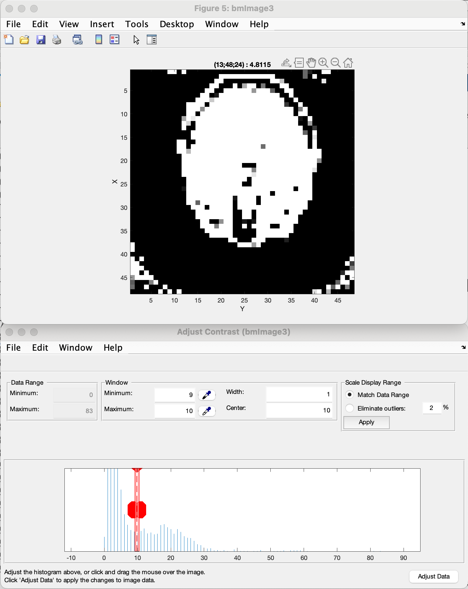
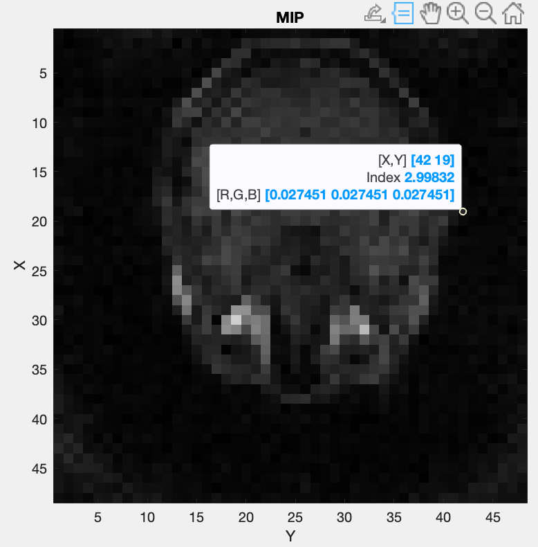
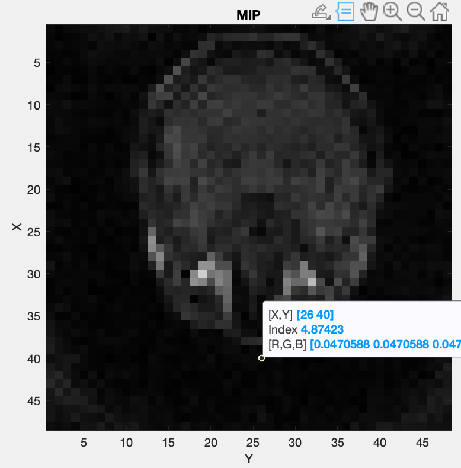

Coil Sensitivity Map Estimation
=================================
This section explains how to extract the coil sensitivity map with our implementation. 
After obtaining the body coil pre-scan and the selected coil pre-scan data, we first extract and read the metadata from these pre-scan files.

.. code-block:: matlab

    bmTwix_info(bodyCoilFile)
    bmTwix_info(arrayCoilFile)

Based on the twixinfo output displayed above, we can generate the trajectory variables as follows:

.. code-block:: matlab

    N            = 128; 
    nSeg         = 22; 
    nShot        = 419; 
    FoV          = [480, 480, 480]; 
    nShotOff     = 10; # Off stedy-state shots 
    N_u          = [48, 48, 48]; # Size 
    dK_u         = [1, 1, 1]./480; 

    nCh_array    = 42; # number of selected coils
    nCh_body     = 2;  # number of body coils 

Note that the initialization of the variables is not automated, as their names and contents depend on the specific programmed sequence. Currently, we simply read and print the TwixInfo and set the input variables as an example. You will need to adjust the parameters manually. In the future, we plan to develop a function to automate the ISMR raw data format for standardization.
We called the function `bmCoilSense_nonCart_dataFromTwix` to generate the raw data, trajectory points, and the volume element for the body coil.

.. code-block:: matlab

    [y_body, t, ve] = bmCoilSense_nonCart_dataFromTwix( bodyCoilFile, ...
                                                        N_u, ...
                                                        N, ...
                                                        nSeg, ...
                                                        nShot, ...
                                                        nCh_body, ...
                                                        FoV, ...
                                                        nShotOff)

Within the function `bmCoilSense_nonCart_dataFromTwix`:

- Extract raw data: `bmTwix_data`
  
- Compute trajectory: `bmTraj_fullRadial3_phyllotaxis_lineAssym2`
  
  - Here we assume the use of a 3D phyllotaxis trajectory.
    
- Calculate the volume element: `bmVolumeElement`
  
  - We designed different options of trajectories as inputs to the function.
    
    .. code-block:: matlab
    
        ve      = bmVolumeElement(t, 'voronoi_full_radial3')

    For example, in this case, we use the voronoi algorithm to calculate the volume given a 3D radial trajectory.
    
    Please review the codes and choose the appropriate option for your application.
    
    [can add more description of the options here]
    
    If none of the provided cases match your trajectory, you will need to define your own volume element calculation function.
    
- Retain only the raw data within a specified box (defined by N_u) to preserve the frequencies for lower resolution. (?)

We use the same function to calculate the raw data for the selected array coils.
.. code-block:: matlab

    y_array = bmCoilSense_nonCart_dataFromTwix( arrayCoilFile, ...
                                                N_u, ...
                                                N, ...
                                                nSeg, ...
                                                nShot, ...
                                                nCh_array, ...
                                                FoV, ...
                                                nShotOff)

Note that two plots will appear:

You should change the value of the nShotOff = ?; parameters, by looking at the index where the magnitude starts to be constant. For example in this case:

nShotOff = 10 is a good value for steady state. (You could even argue 7 or 8).

Then we compute the gridding matrices:

.. code-block:: matlab

    [Gn, Gu, Gut] = bmTraj2SparseMat(t, ve, N_u, dK_u)

Here, `Gn` and `Gut` perform the backward transformation (from non-Cartesian to Cartesian), while `Gu` performs the forward transformation (from Cartesian to non-Cartesian).

We now compute the mask using two thresholds to exclude artifacts from regions without signals, such as air in the lungs. This is particularly relevant for the center region of the coil sensitivity plot. The methods used for this computation are:

- Root Mean Square (RMS)
- Maximum Intensity Projection (MIP)

First, we run the function bmCoilSense_nonCart_mask to generate an initial mask. Note that you can adjust the RMS threshold and MIP threshold to find a good tradeoff between signal and noise. A good choice is a threshold value that only leaves some noise in the corners, and that minimize information loss in the ROI. To adjust the threshold value you can use: SHIFT + E, and set the width to zero then move it till you are happy with the result. For example here:

A filter value of 10 is a good choice. 

The variables `x_min`, `x_max`, `y_min`, `y_max`, `z_min`, and `z_max` should be adjusted to constrain the range of the Region of Interest (ROI) based on the displayed map. The ROI should be a box surrounding your signal area. For example in this case of a brain image:

The values x_max = 42 and y_max = 40 are good choices. To switch across dimentions you can use CTRL + SHIFT + x, or CTRL + SHIFT + y, or CTRL + SHIFT + z.

Next, we iteratively rerun the function `bmCoilSense_nonCart_mask`, adjusting `x_min`, `x_max`, `y_min`, `y_max`, `z_min`, `z_max`, and the thresholds until the optimal mask is achieved.

.. code-block:: matlab

   [y_ref, C_ref] = bmCoilSense_nonCart_ref(y_body, Gn, m, []);
   C_array_prime = bmCoilSense_nonCart_primary(y_array, y_ref, C_ref, Gn, ve, m);

With this initial coil sensitivity ``C_array_prime``, we estimate a better coil sensitivity by using gradient descent. This process alternately updates the coil sensitivity map ``C`` and the reconstructed image ``X`` to solve :math:`||FXC - y||`.

For this example, we set ``nIter=5``.

.. code-block:: matlab

   nIter = 5;
   [C, convCond_out, x] = bmCoilSense_nonCart_secondary(y_array, C_array_prime, y_ref, C_ref, Gn, Gu, Gut, ve, nIter, true);

We can save the coil sensitivity ``C`` as a MATLAB data file for further reconstruction.
 
For reference, we use one body coil to compute its sensitivity and then estimate the coil sensitivity for each selected surface coil using the image from the body coil. We know that the image seen by coil c is:

.. math::

   X_c = C_c.*x_{ref}

Unfortunately we do not have access to the true image x_ref. However since the body coil are far from the ROI, we can assume that inside the ROI, their coil sensitivity is constant. Hence:

.. math::

   X_{body} = k*x_{ref}

   x_{ref} = \frac{X_{body}}{k}

Given our assumption we can simply estimate the coil sensitiviy for coil_c:

.. math::

   X_c = C_c \odot x_{ref} \approx C_c \odot \frac{X_{body}}{k}
   \frac{C_c}{k} \approx X_c ./ X_{body}

Note that the multiplication and divisions are element-wise.
In any case the coil sensitivities are normalized, so the k factor is not relevant.
We then apply some smoothing by imposing that the laplacian of the coil sensitivity is zero outside the ROI.