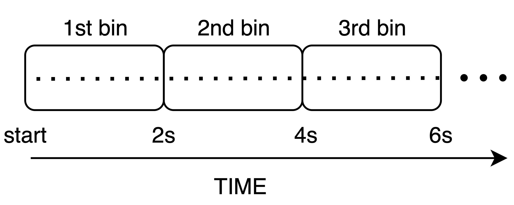

First Example: Sequential Binning
=================================

*Author : Mauro Leidi*

Sequential binning is one of the simplest ways to partition lines, splitting data sequentially by acquisition time. This method is particularly useful for imaging modalities that depend on temporal dynamics, such as resting-state fMRI, where we want to monitor the timecourse of the BOLD signal across brain regions. In sequential binning, we aim to generate a sequence of frames as illustrated below:

For this example, we assume the unit of time is milliseconds, and that we want to produce a temporal sequence of images, each one containing data acquired over a period of 2 seconds (window size).

Steps for Sequential Binning
----------------------------

   

1. **Initialize and Set Parameters**:
   Start by configuring the temporal window size and extracting metadata from the acquisition parameters. The `RawDataReader` object provides the necessary data for binning, such as the number of measures, the number of segments per shot (`nSeg`), and timestamps for each readout.

   .. code-block:: matlab

      % Set temporal window size
      temporalWindowSec = 2; %magic number
      
      % Extract parameters from acquisition
      acquisitionParams = reader.acquisitionParams;
      % Total amount of lines
      nLines = acquisitionParams.nLine;
      % This only makes sense for phyllotaxis spiral
      nSeg = acquisitionParams.nSeg;
      % Non steady state lines
      nSegNotSS = acquisitionParams.nShot_off*acquisitionParams.nSeg;

2. **Adjust and Scale Timestamps**:
   The timestamps from the acquisition are adjusted to remove non-steady-state measurements, which are not used for image reconstruction. These timestamps are converted into milliseconds for easier manipulation.

   .. code-block:: matlab

      % Adjust timestamps and scale to milliseconds
      costTime = 2.5;  % Siemens-specific constant
      timeStamp = acquisitionParams.timestamp;
      timeStamp = timeStamp - min(timeStamp);
      % Relative time w.r.t. beginning of acquisition in milliseconds
      timestampMs = timeStamp * costTime; 
      % Non steady state time: example of filtering
      notSSTime = timestampMs(nSegNotSS);

3. **Determine the Number of Temporal Bins**:
   Based on the total duration of valid data, calculate how many temporal bins (masks) are needed. Each bin corresponds to a fixed duration (e.g., 2 seconds).

   .. code-block:: matlab

      % Calculate total duration and number of temporal bins (masks)
      totalDuration = max(timestampMs) - notSSTime;
      temporalWindowMs = temporalWindowSec * 1000;
      nMasks = floor(totalDuration / temporalWindowMs);

4. **Create and Assign Bins**:
   For each temporal bin, identify the corresponding measurements based on their timestamps. The binning masks (`seqMask`) are initialized as logical arrays, where each bin corresponds to a set of measurements that occurred within the temporal window. SI projections (special measurements that should not contribute to image reconstruction) are excluded from each bin.

   .. code-block:: matlab

      % Initialize binning masks
      seqMask = false(nMasks, nLines);
      % Populate the masks for each time window
      for i = 1:nMasks
            windowStart = notSSTime + (i-1) * temporalWindowMs;
            windowEnd = windowStart + temporalWindowMs;
            % Create mask for the current time window
            mask = (timestampMs >= windowStart) ...
            & (timestampMs < windowEnd);
            % Assign the mask to the bin matrix
            seqMask(i, :) = mask;
      end

The reconstructed images result from the contribution of each line within the associated bin. In this case, the image represents the average BOLD signal over the 2-second interval corresponding to each bin.

.. tip::
   The binning process is usually composed of two main parts:

   1. A filtering of data not adeguate for image reconstruction (e.g., not steady state)
   2. A partition of the data, to produce several frames.

   Clearly the partitioning depends on the analysis that will be applied later.
   For example, to estimate rigid motion we are need to apply sequential binning.

