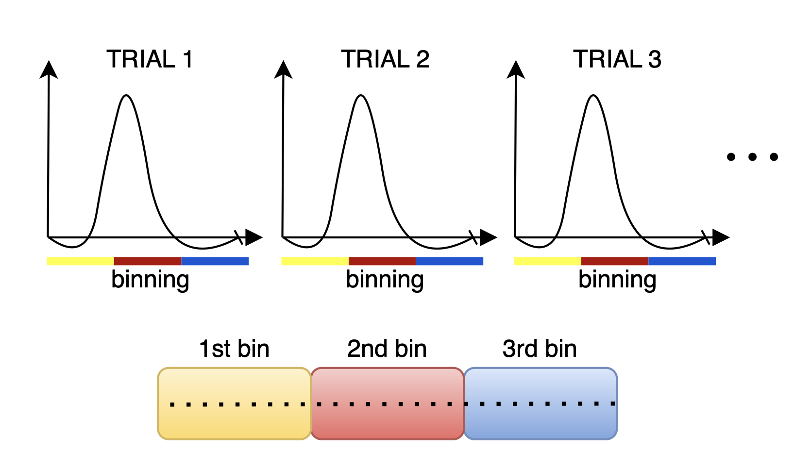

Second Example: Task-Based (Hi-Fi) fMRI
========================================

This section discusses the binning process for task-based fMRI, which focuses on isolating the haemodynamic response to specific stimuli. By averaging multiple trials, this method effectively reduces the contributions of temporally uncorrelated brain activity, resulting in a clearer signal.

For instance, in a visual stimulation study, delayed activation in the brain's visual processing regions can be captured without assumptions about the shape of the haemodynamic response. This is done by combining readouts from several trials and reconstruct images that reflect the average response across trials, minimizing the effect of noise from activations that are uncorrelated with the stimulation.

To implement this binning strategy, we generate a logical array, `hifiMask`, of size `[nBins, nLines]`, where `hifiMask(i, j)` is true if the j-th measurement corresponds to the i-th bin. The number of bins is determined by the total duration of the trial and the temporal resolution we aim to achieve for the haemodynamic response. Of course you need to have enogh lines in each bin if you want to successfully reconstruct images.

Steps for Hi-Fi Binning:
------------------------

1. **Initialize and Set Parameters**:
   
   We extract parameters from the `RawDataReader` object, which include the number of measurements, segments, and the number of shots to exclude. This information is vital for creating the mask and ensuring accurate binning.

   .. code-block:: matlab
      
      % Extract parameters from acquisition
      acquisitionParams = reader.acquisitionParams;
      % Total amount of lines
      nLines = acquisitionParams.nLine;
      % This only makes sense for phyllotaxis spiral
      nSeg = acquisitionParams.nSeg;
      % Non steady state lines
      nSegNotSS = acquisitionParams.nShot_off*acquisitionParams.nSeg;

2. **Calculate Timestamps:**

   Normalizing the timestamps allows us to accurately track the timing of each measurement in milliseconds. This is essential for defining the intervals for each bin.

   .. code-block:: matlab
   
      % Adjust timestamps and scale to milliseconds
      costTime = 2.5;  % Siemens-specific constant
      timeStamp = acquisitionParams.timestamp;
      timeStamp = timeStamp - min(timeStamp);
      % Relative time w.r.t. beginning of acquisition in milliseconds
      timestampMs = timeStamp * costTime; 
      % Non steady state time: example of filtering
      notSSTime = timestampMs(nSegNotSS);

3. **Determine Number of Bins:**

   Based on the total duration of the trial and the specified temporal resolution, we calculate the number of bins required for the analysis. This is essential for structuring the `hifiMask` array correctly.

   .. code-block:: matlab

      % We assume the stimulation and acquisition are synchronized
      nMasks = floor(trialDurationSec / temporalResolutionSec);
      windowDuration = trialDurationSec/nMasks;

4. **Initialize the Mask Matrix:**

   Create a logical mask matrix initialized to `false`, which will be populated with `true` values indicating the measurements belonging to each bin.

   .. code-block:: matlab

      hifiMask = false(nMasks, nLines);

5. **Populate the Bin Masks:**

   For each bin, we define the time window and create a mask that indicates which measurements fall within that window. We also exclude specific measurements corresponding to SI projections to enhance the quality of the data. In this case we have to handle non steady state a bit differently: we cannot shift all the bins temporally as in the previous example, this is because binning is linked to the visual stimulation temporally.

   .. code-block:: matlab

      start = 0;
      for i = 1:nMasks
         maskOffset = (i-1)*(temporalResolutionSec)*1000
         for j = 1:nTrials
            % Define the start and end of the current trial
            trialStartTime = (j-1)*trialDurationSec*1000

            windowStart = trialStartTime + maskOffset; % Convert to ms
            windowEnd = windowStart + (temporalResolutionSec)*1000;
            
            % Create the mask for the current trial
            % Remove non steady state data
            mask = (timestampMs >= notSSTime) ... 
            &  (timestampMs >= windowStart) ...
            & (timestampMs < windowEnd);

            % Assign the mask to the hifiMask matrix
            hifiMask(i, :) = hifiMask(i, :) | mask;
      end

The resulting `hifiMask` will allow for the reconstruction of images that reflect the average haemodynamic response across trials, facilitating more accurate analysis of brain activation during task-based fMRI studies.

