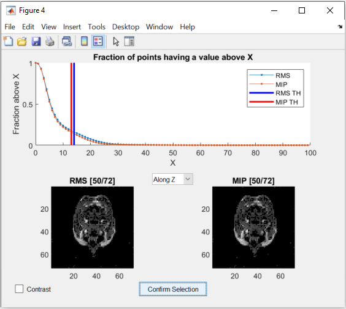
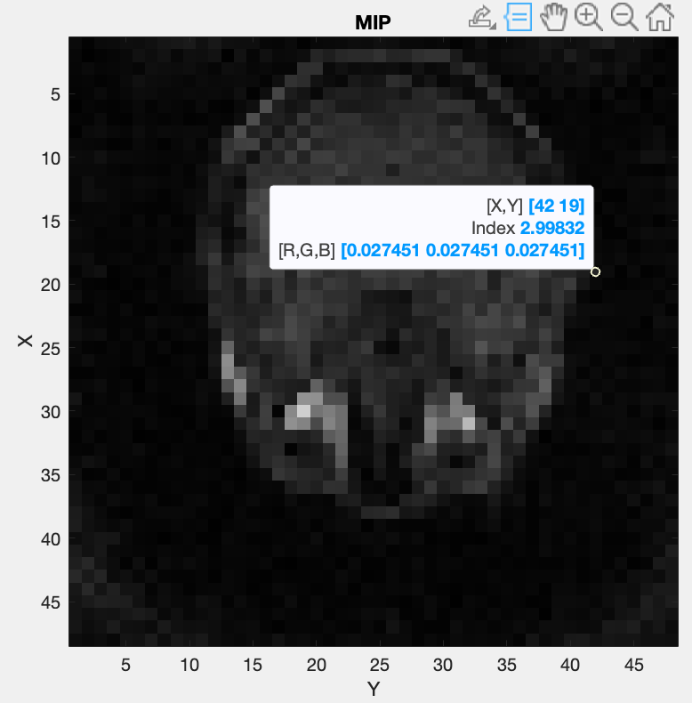

===============================
Coil Sensitivity Map Estimation
===============================

.. contents::
   :local:

This section explains how to generate an estimate of the coil sensitivity map using this framework.

.. warning::
   For this an acquisition of the body coil pre-scan and the selected acquisition coil pre-scan data is required. Either you need pre-scan images or two pre-scan raw datas.
   For the moment we only support ISMRMRD (.mrd) and Siemens raw data (.dat) files.

Coil sensitivity from pre-scan images
=====================================

Computing coil senstivity from pre-scan images is simpler but yields a worst estimation of the real coil sensitivity. You need two body coil images and one image per acquisition coil.  

.. warning::
   
   The FOV position and orientation of the images should be the same.

This script https://github.com/MattechLab/monalisa/blob/main/examples/scripts/coilSense_from_prescan_images_script.m illustrates how to run the coilsensitivity estimation from prescan images. The estimation of the coil sensitivity is done in two steps:
1. In the first step the user should define a pre-scan mask on the ROI using the body coil image, this helps to estimate the coil sensitivity excluding the noise.
2. In the secon step the function bmCoilSense_prescan_coilSense is called, to estimate the acquisition coils sentitivities.

The images are required to be 3D matlab arrays.

Coil sensitivity from raw data pre-scans
========================================

The process of extracting the acquisition metadata and the parameters for the generation of the ROI mask can either be done automatically or controlled by the user.
The used mode can be changed using the dedicated flag at the start of the `coilSense_from_prescan_rawdata_nonCart_ISMRMRD_script` script.

.. warning::

   The FOV position and orientation of the raw-data pre-scans should be the same.

.. code-block:: matlab

   % Flag; decide on values automatically if true, require user input if false
   autoFlag = true;

At the start of the script, the paths to the files and to the folder where the map should be saved can be set.
The resulting map is only saved if the save flag is set to true.

.. code-block:: matlab

   % Flag; saves the coil sensitivity map if true
   doSave = true;

If the paths aren't set in the script, a file selection dialog box will pop up at run time, where the user has to select the pre-scan .mdr files.
In order the body coil file,  the surface coil file and the directory where the result is saved (if the flag is set to true).

.. _automatedEstimation:

Automated Estimation
====================

In automated mode, the user only needs to provide one additional input: confirming the selection of the region of interest (ROI) for reconstruction. 
This region is essential for estimating the coil sensitivity. Ensure that the blue box completely encompasses the area you wish to image, but select the smallest possible bounding box. Pixels outside this region are estimated by solving the Laplace equation:

.. math::
   \Delta f = 0

The blue selection can be modified by dragging the vertices of the boxes. The values are updated either after releasing the vertex or, if the "Update on move" option is ticked, while dragging the vertex.
Two of these figures will open, during which the code execution is interrupted until confirmation, one for Root Mean Square (RMS) values and one for the Maximum Intensity Projection (MIP):

.. image:: ../images/ROI-selection.png
   :width: 100 %
   :alt: The region of interest selection has to be confirmed.

.. note::
   The images in this figure are created by summing along an axis to represent the view.
   If this option doesn't create a usable image, please use the :ref:`figures <roiFigures>` in the manual estimation mode.

   The minimum and maximum values can only be changed directly in manual estimation.

After checking that the ROI is correct, the selction has to be confirmed by pressing on the "Confirm Selection" button.

The rest of the estimation is done automatically and the resulting matrix is saved in the given folder with the following naming convention:

   ``coil_sensitivity_map_yyyy-mm-dd-hh-mm.mat``

Manual Estimation
=================

Using the manual estimation requires some more confirmation from the user. Namely of the parameters extracted and the threshold to differentiate between noise and data.
There will be more figures shown that allow to check the region of interest in more detail as well as the effect of the secondary coil sensitivity estimation.

Acquisition Parameters
----------------------

The acquisition parameters are automatically extracted from the ISMRM raw data files and presented in the following figure. Make sure that the values displayed are correct.

.. image:: ../images/acquisition_parameters.png
   :width: 90 %
   :align: center
   :alt: Modify and confirm the acquisition parameters.

The code execution is interrupted until the figure is closed.
The table allows the user to modify the extracted acquisition parameters in the third column "User Value". 
On the right, the navigation and the trajectory type can be selected, as well as an option to remove oversampled data.

.. note::
   Only the non-cartesian trajectory and the navigation using the SI line is implemented.

This has to be done for the body coil first and then for the surface coils.
To select a good number for the shots to be dropped as they are taken before the steady state is reached, a figure is shown.
The figure indicates which number was selected automatically.

Here is the figure for the SI navigation together with the same figure zoomed into the first few shots:

.. image:: ../images/Steady-state-determination.png
   :width: 100 %
   :alt: Steady state is determined by looking at the evolution of the magnitude of the SI projection.

Note that the number of shots to be discarded can be updated by dragging the vertical line in this figure.

.. warning::
   Only the number of channels (coils) will be stored from the body coil.
   The changes to the other parameters have to be done in the second figure for the surface coils.

Mask Creation
-------------

The mask is used to select voxels for which valuable data is present. This should exclude artifacts and noise.
To achieve this, thresholds and a region of interest (ROI) selection are used to create the mask.

Threshold
^^^^^^^^^

To ensure that the estimation is only done for voxels that contain meaningful data, a threshold is used to seperate noise from data.
One threshold is for the RMS value of the voxels, which is calculated over all the body coils and the other is for the MIP value.
Both of them are set seperately by dragging the two lines in the figure below:

The figure allows to change the view of the two images as well as changing between a binary and a continuous representation.
While dragging the lines in the graph in the top half, the images update the voxels to show which are below the threshold. 

.. _roiFigures:

Region of Interest
^^^^^^^^^^^^^^^^^^

The selection of the ROI is done the same way as in the :ref:`Automated Estimation <automatedEstimation>`.
But additionally, three more figures are shown:

- The RMS values as a 3D image.

- The MIP values as a 3D image.

- The RMS values next to the created mask as a 3D image.

The first two figures allow a closer inspection of the image. 
This can be used to more precisely find the ROI and threshold values.
To get more precise values for the ROI, the MATLAB figure's "Data Tips" tool can be used, while scrolling through the different views.
Alternatively, the left mouse button can be used to click on a pixel, which shows its coordinates in the title.

To further inspect the threshold, MATLAB's "Adjust Contrast Tool" can be used by pressing Ctrl + e.
By reducing the range of the allowed contrast, the image can be shown in a binary representation and a threshold value can be selected using the lower limit of the range.
Using Shift + e before changing the image allows to apply the adjusted contrast to the whole image and scrolling through it to observe the effect of the set threshold.

Here is an example:

.. image:: ../images/filtering.png
   :width: 90 %
   :align: center
   :alt: Changing the contrast of the image.

.. note::
   The view can be changed by pressing Ctrl + Shift + x , y or z.

   Note that the coordinates shown change as well depending on the view. 
   They are not always reprented as (x, y, z), but depend on the axes shown.

   By pressing the key "h", the help information for the figure is written in the Matlab console. 
   This information explains all the possible options to manipulated the visualization of the data.

The third figure allows visual confirmation of the accuracy of the created mask. 
Keep in mind that the goal of the tresholding is to remove as much noise as possible, 
but to keep most of the information intact to achieve the best coil sensivity estimation. 
The example shown, give you an idea of a correct thresholding, with most of the brain data mantained with only a small amount of residual noise in the corners, that will be filtered out by the bounding box selection.

Sensitivity Approximation
-------------------------

After the first estimation of the coil sensitivity, a heuretic gradient descent algorithm is applied to improve on this estimation.
This is done iteratively for a number of iterations that can be set in the script. For further explanation see `ImprovedEstimation`_.

After each gradient descent step, an image is generated that shows the combined image using the coils. This can be used to control the effects of the gradient descent.

Code Explanation
================

This part goes into a bit more detail of the code, which allows to more easily modify the coil sensitivity estimation process.

Path selection
--------------

The script starts out by setting the two flags mentioned above. Afterwards the paths of the files and the destination folder are set.
These can be set directly in the scrip to skip the selection during execution.

.. code-block:: matlab

   bodyCoilFile = [];
   arrayCoilFile = [];

   saveFolder = [];

Parameters
----------

The acquisition parameters are then read out in the function call:

.. code-block:: matlab

   [myMriAcquisition_node, reconFoV] = ISMRMRD_readParam(arrayCoilFile, autoFlag);

myMriAcquisition_node is an object of the class bmMriAcquisitionParam and is storing the acquisition parameters.
As this is the object used for the extraction of the data, this step can be skipped if the parameters are set manually:

.. code-block:: matlab

   myMriAcquisition_node = bmMriAcquisitionParam([]); 
   myMriAcquisition_node.N = 128;
   ...
   myMriAcquisition_node.FoV = 240;
   reconFoV = 240;

The estimation is done on a low resolution image to improve the result. The grid, which defines the resolution is set at the end of the section.

.. code-block:: matlab

   N_u = [48, 48, 48];

This value can be changed to fit the user's needs. Good values range from 48 to 96. A too high resolution reduces the signal to noise ratio and increases execution time drastically.

Data extraction
---------------

In the function `bmCoilSense_nonCart_dataFromISMRMRD`, the raw data is extracted, the trajectory is generated and the volume elements are computed.

.. code-block:: matlab

   myMriAcquisition_node.nCh = nCh_body;
   [y_body, t, ve] = bmCoilSense_nonCart_dataFromISMRMRD(
                        bodyCoilFile, ...
                        N_u, ...
                        myMriAcquisition_node);

.. note::
   Both the trajectory and the volume element computation method have to be changed manually and the trajectory is not yet read out of the ISMRM raw data file.
   Later on, the option to choose should be implemented in a gui element.

Within the function `bmCoilSense_nonCart_dataFromTwix`:

- The trajectory is generated using the function `bmTraj_fullRadial3_phyllotaxis_lineAssym2`.

   - Here, the use of a 3D phyllotaxis trajectory is assumed.

   - This function has to be changed for another if the trajectory required is different.

- The volume elements are computed using the function `bmVolumeElement`.

   - Different options are implemented for different types of trajectories and for different computation methods. The options are all listed in the documentation of the function. For example, in the following case, the voronoi algorithm is used to calculate the volume given a 3D radial trajectory (t).

   .. code-block:: matlab

      ve = bmVolumeElement(t, 'voronoi_full_radial3')

   - If none of the provided cases match the acquisition's trajectory, a new volume element calculation function has to be defined.

- Retain only the raw k-space data within a specified box (defined by N_u and the FoV).

   - This preserves the lower frequencies, removing any high frequency detail, resulting in a lower resolution.

The same function is used once again to extract the raw data of the selected array coils. 
The number of coils are updated to match the selected array coils.

.. code-block:: matlab

   myMriAcquisition_node.nCh = nCh_array;
   y_array = bmCoilSense_nonCart_dataFromISMRMRD(
               arrayCoilFile, ...
               N_u, ...
               myMriAcquisition_node);

.. _gridding_matrices:

Gridding Matrices
-----------------

The next step is computing the gridding matrices:

.. code-block:: matlab

   [Gn, Gu, Gut] = bmTraj2SparseMat(t, ve, N_u, dK_u)

Here, `Gn` and `Gut` perform the backward transformation (from non-Cartesian to Cartesian), while `Gu` performs the forward transformation (from Cartesian to non-Cartesian).

Mask Creation
-------------

The creation of the mask is done using two thresholds to exclude artifacts from regions without signals, such as air in the lungs, and a ROI selection to exlude artifacts outside the ROI.
This is particularly relevant for the center region of the coil sensitivity plot and is done in the function `bmCoilSense_nonCart_mask_automatic`.

.. code-block:: matlab

   m = bmCoilSense_nonCart_mask_automatic(y_body, Gn, autoFlag);

The function also accepts predefined values for the thresholds and the ROI instead of deciding on them during the execution. See the function documentation for more information.

Coil Sensitivity Estimation
---------------------------

The first estimation is done using the following to functions:

.. code-block:: matlab

   [y_ref, C_ref] = bmCoilSense_nonCart_ref(y_body, Gn, m, []);
   C_array_prime = bmCoilSense_nonCart_primary(y_array, y_ref, C_ref, Gn, ve, m);

Where the `bmCoilSense_nonCart_ref` function uses the body coils to create a reference coil sensitivity map, with the masked parts smoothed by solving the Laplace equation.
The output reference coil is always taken as the **first** body coil. To change this, the following lines have to be changed in the function:

.. code-block:: matlab

   C_ref = C(:, 1); 
   y_ref = y(:, 1); 

And the `bmCoilSense_nonCart_primary` function creates an initial estimation of the coil sensitivity for all surface coils.

.. _ImprovedEstimation:

Improved Estimation
-------------------

With the initial coil sensitivity ``C_array_prime``, a better coil sensitivity is estimated using gradient descent in the function `bmCoilSense_nonCart_secondary`. 
This process alternately updates the coil sensitivity map ``C`` and the reconstructed image ``X`` to solve :math:`||FXC - y|| = 0`.
The coil sensitivity map of the reference coil remains unchanged to restrict the changes and not have ``C`` and ``X`` diverge.

How many iteration of the gradient descent should be performed can be set using ``nIter``:

.. code-block:: matlab

   nIter = 5; 
   [C, x] = bmCoilSense_nonCart_secondary(
               y_array, C_array_prime, y_ref, ...
               C_ref, Gn, Gu, Gut, ve, nIter, ...
               ~autoFlag); 

The coil sensitivity ``C`` is saved as a matrix in a MATLAB data file for the next step.
The code can be modified to save the reconstructed image ``x`` as well.

.. For an explanation of the math behind it, see :doc:`3-1_theory`.