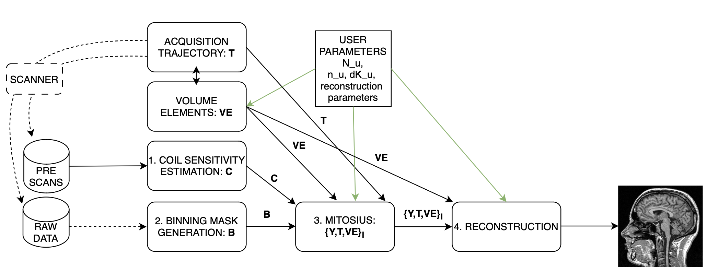

=====================================
Tutorial 1: Reconstruct MRI rawdata
=====================================

Welcome to this tutorial! In this guide, we will use **Monalisa** to reconstruct MRI raw data. 
This tutorial aim to give you a first good experience with the toolbox, providing you with all the essential information to reconstruct your own data.
We'll start with a set of files: 

- A **brain scan** dataset (the main scan).
- Two **prescans** for coil sensitivity estimation:
    - A **body coil** prescan.
    - A **head coil** prescan.

Some MATLAB scripts are provided to help us produce images step by step. While the process involves multiple stages illustrated in the figure below, we will walk you through each of them.

For this tutorial we provide a folder organized as follows:
::

    tutorial1/
    ├── scripts/
    │   ├── coilSensitivityEstimation.m
    │   ├── binnings.m
    │   ├── mitosius.m
    │   └── reconstructions.m
    ├── data/
    │   ├── bodyCoil.dat # this is the body coil prescan
    │   ├── brainScan.dat # this is the actual brain data
    │   ├── surfaceCoil.dat # this is the brain coil prescan

To start working on this tutorial, and get the needed data you need to:
If you haven't done it already, clone monalisa

.. code-block:: bash

    git clone git@github.com:MattechLab/monalisa.git
    

Download the data needed for tutorial 1, this can take a while depending on your internet connection:

.. code-block:: bash
    
    # Make the folder writable (to download the data)
    cd monalisa/demo/data_demo/
    chmod u+w data_8_tutorial_1
    cd data_8_tutorial_1
    # Make the sh file executable
    chmod +x downloadData.sh 
    # Execute the file: Download the data
    ./downloadData.sh

Make sure you add the /src folder to your matlab searchpath and you are now ready to follow the tutorial.

Step 1: Compute Coil Sensitivity
================================

The first step is to compute **coil sensitivity maps**, which describe how each coil "sees" the object being scanned. This is crucial for proper reconstruction.

For this step, we use the provided `coilSensitivityEstimation_script.m` script that can be found in monalisa/demo/script_demo/script_tutorial_1.  
The only parameter you need to adjust is the **virtual Cartesian grid size** (`N_u`).  

.. note::

    We recommend setting `N_u` between **48** and **96** for optimal results.  

Script Overview:
-----------------
Below is the main structure of the `coilSensitivityEstimation_script.m` script:

.. code-block:: matlab

    %% Coil Sensitivity Estimation
    % Define paths for data and results
    baseDir = fileparts(mfilename('fullpath'));  % Current script directory
    dataDir = fullfile(baseDir, '..', 'data');   % Input data folder
    resultsDir = fullfile(baseDir, '..', 'results');  % Output folder
    
    % Ensure results folder exists
    if ~exist(resultsDir, 'dir')
        mkdir(resultsDir);
    end
    
    bodyCoilFile = fullfile(dataDir, 'bodyCoil.dat');      % Body coil prescan
    surfaceCoilFile = fullfile(dataDir, 'surfaceCoil.dat');% Surface coil prescan
    
    %% Load Data
    bodyreader = createRawDataReader(bodyCoilFile, true);
    surfaceReader = createRawDataReader(surfaceCoilFile, true);

    %%  Cartesian grid spacing (dk_u) and grid size (N_u)
    dK_u = [1, 1, 1] ./ headCoilReader.acquisitionParams.FoV;   
    N_u = [48, 48, 48];             % Adjust this value as needed

    %% Compute Coil Sensitivity
    [y_body, t, ve] = bmCoilSense_nonCart_data(bodyreader, N_u);
    y_surface = bmCoilSense_nonCart_data(surfaceReader, N_u);

    [Gn, ~, ~] = bmTraj2SparseMat(t, ve, N_u, dK_u);
    % First we compute a binary mask to enhance our estimation
    mask = bmCoilSense_nonCart_mask_automatic(y_body, Gn, true);
    %% Estimate Coil Sensitivity
    % Reference coil sensitivity using the body coils. This is used as 
    % a reference to estiamte the sensitivity of each head coil
    [y_ref, C_ref] = bmCoilSense_nonCart_ref(y_body, Gn, mask, []);
    % Head coils sensitivities estimation using body coil reference
    C = bmCoilSense_nonCart_primary(y_surface, y_ref, C_ref, Gn, ve, mask);

    % Save Results
    saveName = fullfile(resultsDir, 'coil_sensitivity_map.mat');
    save(saveName, 'C');
    disp(['Coil sensitivity maps saved to: ', saveName]);

This script performs three main function calls:

1. **Compute a binary mask**  
   A binary mask, ``mask``, is generated to filter out the contribution of noisy voxels from the estimation process.

2. **Calculate reference coil sensitivity**  
   The body coil is used to calculate a reference coil sensitivity, which serves as a baseline for comparison.

3. **Compute individual coil sensitivities**  
   Using the reference coil sensitivity, the script computes the individual coil sensitivities.

After running the script, we can observe the generated maps. These maps represent how different coils perceive the imaging field.

Step 2: Binning
================

Binning is highly related to the study design. In the following we illustrate several very different binning strategies in increasing difficulty level.

Step 2.1: allLines Binning - A Single Bin
==============================================================

The first binning strategy we will use is **allLines binning**, which groups all usable lines into a single bin. This is the simplest form of binning and serves as a baseline for more advanced strategies. 

**Purpose:**
The goal of this step is to include all lines that are in the steady-state phase and exclude:

- **Non-steady-state lines**: These occur during the initial acquisition phase before the steady-state phase is reached.
- **SI projection lines**: Repeated measurements at the same spatial location (e.g., 1 line every `nSeg = 22`).

**Script Overview:**
We start by initializing a mask that includes all lines, excluding those that cannot be used for reconstruction. Here’s the MATLAB implementation:

.. code-block:: matlab

    %% Step 2: Simple Binning - Include All Steady-State Lines
    % Create a mask with all lines that are in steady state
    % (excluding the first few lines which may be non-steady-state)
    nbins = 1;
    mask = true(nbins, nLines);  % Include all lines except non steady state

    % Exclude non-steady-state lines
    mask(nbins, 1:nExcludeMeasures) = false;

    % Exclude repeated SI projection lines
    for K = 0:floor(nLines / nMeasuresPerShot)
        idx = 1 + K * nMeasuresPerShot;
        if idx <= nLines
            mask(idx) = false;
        end
    end

**Visualization:**
To better understand the generated mask, we plot the binning mask. Different categories of points are displayed:

- **Red Points**: Non-steady-state lines.
- **Orange Points**: SI projection lines.
- **Green Points**: Steady-state lines included in the bin.

.. code-block:: matlab

    %% Visualize the Binning Mask
    figure;
    hold on;

    % Define the color for orange as an RGB triplet
    orangeColor = [1, 0.647, 0];

    % Preallocate the x and y data for each category
    redX = []; redY = [];
    orangeX = []; orangeY = [];
    greenX = []; greenY = [];

    % Categorize the points into red, orange, and green
    for i = 1:length(timeInSeconds)
        if i <= nExcludeMeasures
            redX = [redX, timeInSeconds(i)];
            redY = [redY, simpleBinningMask(i)];
        elseif mod(i, 22) == 1
            orangeX = [orangeX, timeInSeconds(i)];
            orangeY = [orangeY, simpleBinningMask(i)];
        else
            greenX = [greenX, timeInSeconds(i)];
            greenY = [greenY, simpleBinningMask(i)];
        end
    end

    % Plot points by category
    scatter(orangeX, orangeY, 40, orangeColor, 'filled'); % Orange
    scatter(redX, redY, 40, 'r', 'filled');              % Red
    scatter(greenX, greenY, 40, 'g', 'filled');          % Green

    hold off;

    % Add labels and title
    xlabel('Time (s)');
    ylabel('Logical Mask Values (0 = exclude)');
    title('allLine Binning Mask (4.15s to 5s)');
    grid on;
    ylim([-0.1, 1.1]);  % Binary y-axis
    xlim([4.15, 5]);    % Limit x-axis to the specified time range
    set(gca, 'XTick', 4.15:0.05:5);  % Adjust tick density within the range
    set(gcf, 'Color', 'w');  % Set white background for the figure

    % Add a legend with the color descriptions
    legend({'SI point (Orange)', 'Not steady-state points (Red)', 'Other points (Green)'}, 'Location', 'best');

**Interpretation of the Plot:**

- **Red Points**: Indicate non-steady-state lines that are excluded from reconstruction.
- **Orange Points**: Represent SI projection lines, excluded due to redundancy.
- **Green Points**: Indicate steady-state lines included in the reconstruction.

**Output:**
The mask generated in this step groups all steady-state lines into a single bin. This mask will be used as a reference for comparison in subsequent steps.

Step 2.2: Sequential Binning - 5-Second Temporal Bins
=========================================================================

The purpose of this step is to group the measured data into fixed temporal bins of 5 seconds each. This approach allows for systematic segmentation of the dataset while excluding non-steady-state measurements. Below are the details of the process:

Temporal Window Definition
--------------------------
- The temporal window for each bin is set to 5 seconds, defined as:
  
  .. code-block:: matlab

     temporalWindowSec = 5;
     temporalWindowMs = temporalWindowSec * 1000;

- Data is processed within this window size, converting the time to milliseconds for consistency with the timestamp measurements.

Exclude Non-Steady-State Measurements
-------------------------------------
- Non-steady-state measurements, such as the first few "off-shots" or specific artifacts, are excluded by adjusting the start time:

  .. code-block:: matlab

     startTime = timestampMs(nExcludeMeasures + 1);
     endTime = timestampMs(end);

- The `startTime` ensures that the initial excluded data points are not considered during binning.

Binning Mask Creation
---------------------
- The number of temporal bins (`nMasks`) is calculated based on the duration of valid data and the size of the temporal window:

  .. code-block:: matlab

     totalDuration = endTime - startTime;
     nMasks = floor(totalDuration / temporalWindowMs);

- An empty logical matrix (`sequentialBinningMask`) is initialized to store inclusion/exclusion information for each bin.

Filling the Binning Mask
------------------------
- For each bin, a mask is created to identify which measurements fall within the temporal window. This mask is then adjusted to exclude specific lines (e.g., SI projections or other artifacts) based on predefined rules.

  .. code-block:: matlab

     for i = 1:nMasks
         windowStart = startTime + (i - 1) * temporalWindowMs;
         windowEnd = windowStart + temporalWindowMs;
         
         mask = (timestampMs >= windowStart) & (timestampMs < windowEnd);
         
         for K = 0:floor(nLines / nMeasuresPerShot)
             idx = 1 + K * nSeg;
             if idx <= nLines
                 mask(idx) = false;
             end
         end
         
         sequentialBinningMask(i, :) = mask;
     end

A figure is created to display the temporal binning masks. By default, the data for the first bin is displayed, however a dropdown menu is added to allow users to select and visualize different bins interactively.

Step 3: Preparing the Data for Reconstruction (Mitosius)
========================================================

This step organizes the data into the correct format for the reconstruction algorithm. The key tasks in this stage include:

- **Loading the raw brain scan data.**

- **Computing trajectories and volume elements.**

- **Normalizing the data.**

- **Selecting a binning strategy.**

Mitosius Script Overview
------------------------
Below is a streamlined script for the Mitosius step. It prepares the data for reconstruction by leveraging previously computed **coil sensitivity maps** and **binning masks**.

.. code-block:: matlab

    %% Load Raw Data and Compute Trajectories
    reader = createRawDataReader(brainScanFile, false);
    y_tot = reader.readRawData(true, true);
    t_tot = bmTraj(p);
    ve_tot = bmVolumeElement(t_tot, 'voronoi_full_radial3');

    %% Normalize the Data
    x_tot = bmMathilda(y_tot, t_tot, ve_tot, C, N_u, N_u, dK_u);
    temp_im = getimage(gca); 
    temp_roi = roipoly; 
    normalize_val = mean(temp_im(temp_roi(:))); 
    y_tot = y_tot / normalize_val;

    %% Select Binning Strategy
    choice = questdlg('Select a binning strategy:', ...
                      'Binning Selection', ...
                      'AllLines', 'Sequential', 'Cancel', 'AllLines');
    if strcmp(choice, 'AllLines')
        load(allLinesBinningspath, 'mask');
    elseif strcmp(choice, 'Sequential')
        load(seqBinningspath, 'mask');
    else
        error('Binning selection canceled.');
    end

    %% Apply Mitosis
    [y, t] = bmMitosis(y_tot, t_tot, mask);
    ve = bmVolumeElement(t, 'voronoi_full_radial3');
    bmMitosius_create(saveFolder, y, t, ve);

User Interaction: Choosing a Binning Strategy
---------------------------------------------
The script includes a pop-up window allowing the user to choose between the **AllLines** and **Sequential** binning strategies:

- **AllLines Binning**: Groups all steady-state lines into a single bin.
- **Sequential Binning**: Groups the data into temporal bins of 5 seconds.

Upon selection, the appropriate binning mask is applied to the data, preparing it for reconstruction. For the sake of this tutorial, repeat the mitosius step for both binning strategies, to be able to reconstruct both.
The processed data is saved in the `mitosius` directory. This output is now ready for use in the next step: **Reconstruction**.

Efficient Workflow: Local Preprocessing, HPC Reconstruction
============================================================

A key feature of the **Monalisa** workflow is its ability to minimize the computational and data transfer burdens. Instead of directly transferring raw datasets to a High-Performance Computing (HPC) system, **we recommend to preprocess the data locally on your laptop** until the **mitosius** step. This approach ensures that only the essential preprocessed data is transferred, significantly reducing file size and optimizing HPC utilization.

Why This Approach?
-------------------
MRI datasets are typically large, with raw data files often reaching several gigabytes. Transferring such large files to an HPC system can be time-consuming and inefficient. By running the **mitosius** preprocessing step locally, you can achieve the following:

- **Reduced Data Volume**: The **mitosius** step processes and organizes the raw data into a streamlined format, drastically reducing its size while retaining all critical information for reconstruction.
- **Efficient Reconstruction**: The preprocessed data is tailored for computationally intensive reconstruction algorithms, enabling faster execution on HPC systems.
- **Lower Costs**: Fewer data transfers mean reduced network bandwidth usage, saving your time. Running the preprocessing   

Workflow Summary:
------------------
1. **Run the mitosius step locally**:

   - Preprocess your raw data using the provided MATLAB scripts.

   - Save the resulting files in a lightweight format suitable for reconstruction.

2. **Transfer the preprocessed data to HPC, if you have one**:

   - Use secure and efficient transfer methods (e.g., `scp`, `rsync`, or cloud-based storage) to move the smaller dataset to the HPC system.

3. **Perform heavy reconstructions on HPC**:

   - Use Monalisa’s advanced reconstruction algorithms (e.g., Mathilda, Sensa, compressed sensing) to generate high-quality images.

4. **Download and analyze results locally**:

   - Retrieve the reconstructed images and analyze them on your laptop or workstation.

This hybrid approach leverages the strengths of both local and HPC envsironments, providing an optimal balance between convenience and computational power.

.. tip::

    Ensure you carefully verify the preprocessed data before transferring it to the HPC system. Small errors in the **mitosius** step can propagate into reconstruction, leading to suboptimal results.

By following this workflow, you can maximize efficiency and focus on obtaining the highest quality MRI reconstructions with minimal hassle.

Step 4: Running Reconstructions
===============================

Reconstruction Methods Overview
-------------------------------
.. list-table::
   :header-rows: 1
   :align: center

   * - **Method**
     - **Description**
     - **Key Parameters**
     - **Use Case**
   * - **Gridded Reconstruction (Mathilda)**
     - Basic reconstruction using gridding.
     - `N_u`: Grid size  
       `dK_u`: Grid spacing
     - Quick reconstruction for visual inspection or debugging.
   * - **Iterative Sense Reconstruction (Sensa)**
     - Exploits coil sensitivity maps for improved image quality.
     - `C`: Coil sensitivity maps  
       `nCGD`: Number of conjugate gradient iterations  
       `convCond`: Convergence condition. 
     - High-quality images with moderate computing requirements.
   * - **Compressed Sensing (TevaMorphosia_chain)**
     - Reduces undersampling artifacts by temporal regularization (1 temporal dimension).
     - `delta`: Regularization weight  
       `rho`: Convergence parameter  
       `nIter`: Number of iterations
       `Tu, Tut`: Deformation matrices. If not empty, motion compensaiton is performed. 
     - When data is undersampled and/or sparsity of temporal gradient is expected.

Reconstruction Implementation
-----------------------------

The final step is to reconstruct the images using various methods. 
First we need to load the data prepared previously:

.. code-block:: matlab

    y   = bmMitosius_load(allLinesBinningspath, 'y');
    t   = bmMitosius_load(allLinesBinningspath, 't');
    ve  = bmMitosius_load(allLinesBinningspath, 've');

Then we need to decide set some parameters:

.. code-block:: matlab

    reader = createRawDataReader(brainScanFile, false);
    p = reader.acquisitionParams;
    FoV = p.FoV;  % Field of View
    matrix_size = FoV / 3;  % Max nominal spatial resolution
    N_u = [matrix_size, matrix_size, matrix_size];
    n_u = N_u;
    dK_u = [1, 1, 1] / FoV;
    load(coilSensitivityPath)
    % Adjust grid size for coil sensitivity maps
    C = bmImResize(C, [48, 48, 48], N_u);

    % For Iterative Sense
    [Gu, Gut] = bmTraj2SparseMat(t, ve, N_u, dK_u);
    nIter = 30; % Number
    witness_ind = [];
    nCGD      = 4;
    ve_max    = 10*prod(dK_u(:));

    % For CS recon
    [Gu, Gut] = bmTraj2SparseMat(t, ve, N_u, dK_u);
    nIter = 30; % Number
    witness_ind = [];
    delta     = 0.1;
    rho       = 10*delta;
    witness_ind = 1:3:nIter; % Only track one out of three steps
    nCGD    = 4;

Finally we can run the reconstruction, many options are available:

1. **Gridded Reconstruction (Mathilda)**:

   .. code-block:: matlab

      x0 = bmMathilda(y{1}, t{1}, ve{1}, C, N_u, N_u, dK_u, ...
      [], [], [], []);

2. **Iterative Sense Reconstruction (Sensa)**:

   .. code-block:: matlab

      x_sensa = bmSensa(x1, y, ve, C, Gu, Gut, n_u, nCGD, ve_max, ...
       convCond);

3. **Compressed Sensing**:

   .. code-block:: matlab

      x_cs = bmTevaMorphosia_chain(x1, y, ve, C, Gu, Gut, n_u, ...
      delta, rho, nCGD, nIter);

4. **Motion-Compensated Reconstruction (TevaMorphosia)**:

   .. code-block:: matlab

      x_motion = bmTevaMorphosia(x_cs, motionField);

.. tip::

    If the reconstruction is too memory demanding (OOM error), you can consider:
    
    - Reducing the matrix size (and the nominal resolution of the reconstruction)
    - Migrating to high computing resources, which might be needed for advanced reconstructions.
    
    The memory bottleneck is the FFT computation.

Congratulations, you just completed your first reconstructions with Monalisa! You should be able to observe the magic of CS reconstructions, enhancing the image quality significantly. Observe how eye displacements become observable in the image reconstructed using bmTevaMorphosia.

Summary
-------
This tutorial demonstrated the end-to-end workflow for reconstructing MRI data using **Monalisa**. From preprocessing to advanced reconstruction techniques, you now have all the tools to generate high-quality images. Experiment with the methods and parameters to optimize your results.