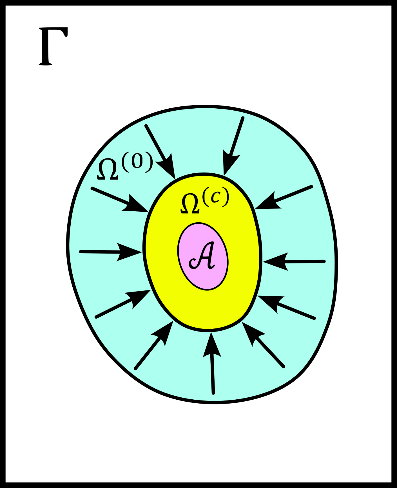

Sketching a Classical Thermodynamic Theory of Information for MRI Reconstructions
=================================================================================

Introduction
------------

The present section is a non-formal essay to sketch some basic features of what could be a 
thermodynamical theory of MRI reconstruction. Our idea is to convince the reader that a 
general picture may be sketched in the future, 
which includes MRI reconstructions, an entropy notion, computers, electrical power, 
reconstruction time, image quality gain, and artificial intelligence. 
Placing Monalisa in that picture allows in particular to understand the intuition that 
motivated the design of our toolbox: to efficiently consume a 
maximum amount of energy with a high performance computer (HPC). 

What we do in fact in this text is an analogy between a heat engine and a computer.
In particular, we find a way to describe a computer performing an MRI reconstruction
in the same way that a heat engine that compresses an ideal gaz in a cylinder. We try
to describe an iterative reconstruction as a machine that compresses the space of the
dynamical variables of the reconstruction, and thus lowering the entropy of the computer 
memory in the same way that a each engine can lower the entropy of an ideal gas. 

As the reader will notice, this discussion can be applied to any iterative
algorithm that solves an inverse problem. The MRI reconstruction process is used here
as a representent example for any iterative inverse-problem solving process. Given the generality
of the statments exposed in this discussion, we can consider it as an attempt to 
formulate a classical (non-quantum) physical theory of information. In the discussion section, 
we will infact make some connection with the principle of Landauer, which makes the bridge
petween physics and information theory by providing an equivalence between energy and information. 

Iterative Reconstructions and Phase Space
-----------------------------------------

Before anything, we would like to indicate that the MRI reconstructions under consideration 
here are iterative reconstructions. These reconstructions appeared historically as iterative 
algorithms to find a minimizer of the non-constrained optimization problem 

.. math::        
    x^\# \in \underset{x \in X}{argmin} \lVert {FC x - y} \rVert ^2_{Y, 2} + \frac{\lambda}{2} R(x)

where :math:`FC` is the linear model of the reconstruction, :math:`X` is the set of MRI images, 
:math:`x` is the candidate MRI image, :math:`Y` is the set of MRI data, 
:math:`y` is the measured MRI data, :math:`\lambda` is the regularization parameter, 
and :math:`R` is a regulariztion function with some nice properties (typically is :math:`R` chosen to be proper, 
closed, convex). The objective function of the above optimization problem is made of 

    - a data-fidelity term, which is small when the modeled data :math:`FCx` is close to the measured data :math:`y`,
    - a regularization term, which is small when the image :math:`x` is close to satisfying some prior-knowledge. 

In this formalism, the choice of a regularization function implements a choice of prior-knowledge. 

This *argmin* problem is the conventional modern formulation of the general MRI reconstruction problem. 
For many choices of regularization function, the reconstruction problem has some minimizers and 
there exists some iterative algorithm that converge to one of the minimizers,
which depends usually on the initial image guess. 
Those algorithms applied to the MRI reconstruction problems are the conventional
iterative reconstruction method. In addition to these conventional methods, 
some heurisitcs methods are inspired from the conventional ones
but perform some heuristic update at each iteration. These methods converge in some cases but they do not 
minimize a given objective function and their convergence is not necessarily guaranteed by any mathematical formalism. 
Some examples of such heuristic reconstruction are iterative methods where some updates of the image or other 
dynamic variables are done by a statistical model. It is an example of use of artificial inteligence for MRI reconstruction. 

Heuristic or not, we consider in the following iterative reconstructions that converges for some given dataset. 
From the view point of discrete dynamical system theory, we can summarize an iterative reconstruction as follows. 
An iterative reconstruction is given by a map :math:`\Phi` from :math:`X \times Z` to :math:`X \times Z`, 
which is parametrized by a list of parameters *param* and the measured data :math:`y`. 
Here is :math:`X` the vector space of all MRI images of a given size, and :math:`Z` is the cartesian product of 
all spaces that contain all other dynamical variables that we will write as a single list :math:`z`.
We considere that a parameter is a constant, known, controlled number and :math:`param` is the list of those.
It includes for example the regularization parameter :math:`\lambda`. 
 
It holds then

.. math ::        
    (x^{(c+1)}, z^{(c+1)}) =  \Phi(x^{(c)}, z^{(c)}; y, param) = \Phi^{(c)}(x^{(0)}, z^{(0)}; y, param)

Note that we write parameters after the ";" and the dynamical variables before. 

We expect from that dynamical system that for any initial value :math:`(x^{(0)}, z^{(0)})` the sequence
converges to a pair :math:`(x^{(inf)}, z^{(inf)})`,  which may depend on the initial value. The set
of all limits is the **attractor** of the dynamical system, that we will write :math:`\mathcal{A}`.  
The stability of each element *a* of the attractor may then be analyzed by the tool of dynamic system theory. 
Note that in practice, the attractor is larger than a single point and the **bassin of attaction** :math:`\mathcal{B}(a)`.
of an elemment *a* of the attractor (the set of initial values that lead to a sequence converging to *a*)
is also lager than a single point.   

For a given objective function to minimize, the art of building an algorithm that finds a minimizer
consists of building a map :math:`\Phi` for which the projection of its bassin of attraction on the 
space :math:`X` co-inside with the set of minimizer of the objective function (or a subset of it). 

We further would like to point out that a non-iterative (single step) reconstruction can 
be seen as an iterative reconstruction. 
For that, we only have to realize that a non-iterative reconstruction is given by a map :math:`\phi`
that does not depends on :math:`(x, z)`: 

.. math ::        
    \Phi(x^{(c)}, z^{(c)}; y, param) = \phi(y, param)

In that sense, all reconstruction are iterative and those we called "non-iterative" 
converge in a single step since

.. math ::        
    (x^{(c+1)}, z^{(c+1)}) = \Phi(x^{(c)}, z^{(c)}; y, param) = \phi(y, param) =  \Phi(x^{(0)}, h^{(0)}; y ,  param)

Iterative reconstruction guided by (based on, unsing, enhenced by...) artificial inteligence 
can be seen as a dynamic system where the implelentation of :math:`\Phi` contains some 
statistical model. For example, if :math:`\mathcal{N}` is a neuronal network trained to predict 
some of the dynamical variables from the measured data set and from a database of good quality images, 
it can be used to update that dynamical variable as each iteration. We can then see :math:`\mathcal{N}`
as a parameter of the map :math:`\Phi`: 

.. math ::        
    (x^{(c+1)}, z^{(c+1)}) =  \Phi(x^{(c)}, z^{(c)}; y , \mathcal{N}, param)

For futur needs, we define here our **phase space** of MRI reconstruction. For that, we will 
get some inpiration from the physics. The spirit of phase space in physics is the 
following. The phase space is a set so that each of its element corresponds to exaclty one 
of the state that the physical system under consideretion can occupy, 
and each of these element carries the complete information about the system occupying that state. 
In classical Hamiltonian mechanic for example, if one knows the position in phase space 
of a physical system at some time, then everything about the system is known at that 
time. In particular, it is then possible to predict all futur states of the system and 
find all its past states. In our case of MRI reconstruction, the map :math:`\Phi` that 
dictates the dynamic may not be invertible. We therefore cannot expect to recover 
the past hisory of a position in phase space, but at least its future states. 
It makes therefore sense to define our phase space as

.. math ::        

    \Gamma =  X \times Z

The state of our system at a given time (a given iteration) is then gien by a 
pair :math:`(x, z)` and its knowledge is sufficient to predict all future states 
by iterating :math:`\Phi` on that pair. Note that the attractor :math:`\mathcal{A}` is 
a proper subset of the phase-space :math:`\Gamma`. Instead of writing :math:`(x, z)` we 
will also write just :math:`\omega`. We will write the initial value as 

.. math ::

    \omega^{(0)} = (x^{(0)}, z^{(0)})

and we we will write the state after :math:`c` iterations as 

.. math ::

    \omega^{(c)} = (x^{(c)}, z^{(c)}) = \Phi^{(c)}(x^{(0)}, z^{(0)}; y, param) = \Phi^{(c)}(\omega^{(0)}; y, param)

An iterative reconstruction process can then be described in two steps: 

    - to choose an initial guess for the image and the other dynamic variables in a set :math:`\Omega^{(0)} \subset \Gamma`. We will call that initial guess :math:`\omega^{(0)} = (x^{(0)}, z^{(0)}) \in \Omega^{(0)}`. 
    - to iterate :math:`\Phi` on :math:`\omega^{(0)}` until the obtained value :math:`\omega^{(c)} = \Phi^{(c)}(\omega^{(0)}; y, param)` is sufficiently close to the attractor :math:`\mathcal{A}`. 

The description of the second step is however not appropriate to the thermodynamical description we are going to present. 
In order to prepare the rest of the discussion, we need to reformulate those two steps in term of sets and distributions.  
For a given subset :math:`\Omega \subset \Gamma` we define

.. math ::

    \Phi^{(c)}(\Omega; y, param) := \{\Phi^{(c)}(\omega; y, param) | \omega \in \Omega\}

Our phase space :math:`\Gamma` can be considered as isomorphic to :math:`\mathbb{C}^n` for some 
positive interger :math:`n` in our context of MRI reconstruction. 
Topologically, it is thus identical to :math:`\mathbb{R}^{2n}`. We will write :math:`\mathcal{L}` the :math:`\sigma`-algebra
of the Lebesgue measurable sets of :math:`\Gamma` so that the pair :math:`(\Gamma, \mathcal{L})` is a measurable space. 
We can then provide this measurable space with any measure :math:`\nu` to obtain a measure space. 

We assume threrefore that :math:`\Gamma` is a measure space with measure :math:`\nu` and we assume that any measurable
subset :math:`\Omega \subset \Gamma` verifies

.. math ::

    \nu \left( \Omega \right) = \int_{\Omega}  d\nu = \int_{\Omega} f_{\nu}(\omega) d\omega

where the integral with respect to :math:`\omega` is the Lebesgue integral 
and :math:`f_{\nu}` is the Radon-Nikodym derivative of :math:`\nu` with respect to the Lebesgue measure.   

In order to build a connection with information theory later, we want to interpret :math:`\nu` as a probability 
measure. But for that we need to specify a subset :math:`P \subset \Gamma` so that

.. math ::

    \nu\left(P\right) = 1

We considere then all Lebesgue measurable sets which are also subset of :math:`P`. They 
form a :math:`\sigma`-algebra that we will write :math:`\mathcal{L}_{P}`. Given a measure :math:`\nu`
on :math:`\mathcal{L}`, we can normalize it so that the measure by :math:`\nu` of :math:`\mathcal{L}_{P}`
is 1, so that the tripple :math:`\left(P, \mathcal{L}_{P}, \nu \right)` is a probability space
(which is nothing more than a measure space where the measure of the entire space is 1). We will also set the constraint

.. math ::

    f_{\nu}(\omega) > 0 \quad \forall \omega \in \Gamma_{support}

in order to avoid some division by 0. There are then mainly two choices of 
interest for :math:`\Gamma_{support}` in our discussion. In the first case, we will 
set :math:`\Gamma_{support}` equal to :math:`\Gamma`, while in the second case, we will 
set :math:`\Gamma_{support}` equal to :math:`\Omega^{(0)}`, as define hereafter.  

We will write :math:`\Omega^{(0)}` the subset of :math:`\Gamma` in which the initial value is chosen
and we will set on it the restriction :math:`\mathcal{A} \subset \Omega^{(0)}`. 

We will write :math:`\Omega^{(c)}` the subset of :math:`\Gamma` defined by

.. math ::

    \Omega^{(c)} := \Phi^{(c)}(\Omega^{(0)}; y, param)

It is the set that contains :math:`\omega^{(c)}`, whatever the initial value of the reconstruction process is. 

Let be :math:`\mu^{(0)}` a probability measure on :math:`\Omega^{(0)}` with probability distribution 
function (PDF) :math:`p_{\mu^{(0)}}` so that the probability that the random variable associated to 
:math:`\mu^{(0)}` appears in a set :math:`\Omega \subset \Omega^{(0)}` is given by

.. math ::

    \mu^{(0)} \left( \Omega \right) = \int_{\Omega}  d\mu^{(0)} = \int_{\Omega}  p_{\mu^{(0)}}(\omega) d\nu 

where :math:`p_{\mu^{(0)}}` is the Radon-Nikodym derivative of :math:`\mu^{(0)}` with respect to :math:`\nu`. 
It holds in particular

.. math ::

    \mu^{(0)} \left( \Omega^{(0)} \right) = 1 

We then reformulate the two steps above as follows: 

    - Instead of chosing an initial guess, we chose a probability measure :math:`\mu^{(0)}` on the set :math:`\Omega^{(0)}` so that :math:`\mu^{(0)}(\Omega^{(0)}) = 1` and so that the initial value :math:`\omega^{(0)}` is a random variable with PDF equal to :math:`p_{\mu^{(0)}}`. 
    - We describe then the iteration process as a contraction of :math:`\Omega^{(0)}` by iterating on it the map :math:`\Phi` until :math:`\Phi^{(c)}(\Omega^{(0)}; y, param)` becomes sufficiently close to :math:`\mathcal{A}`. 

Note that function :math:`p_{\mu^{(0)}}` can be extended over :math:`\Gamma`  be setting it equal to :math:`0` outside :math:`\Omega^{(0)}`. 
The following figure summarizes the situation. 

This description in term of sets and probability disctributions makes abstraction 
of the particular image guess and of the reconstructed image. It can be
considered as a mathematical description of the reconstruction of all possible MRI 
images in parallel, that would be obtained by chosing all initial guess
in :math:`\Omega^{(0)}` in parallel, with a given "density of choice" :math:`\mu^{(0)}`. 

The Heat Engine and the Computer
--------------------------------

Here are a few empirically facts. If the reader does not agree with them, 
just consider that they are assumptions. We assume furthermore that the iterative reconstruction 
in question is correctly implemented. 

    1. Some iterative reconstructions are converging for some given data.  
    2. Given some data and an iterative reconstruction that verifies points 1., the image quality along iterations improves then monotonically, at least in average in some temporal window.   
    3. Each iteration of an iterative reconstruction consumes electric power and time, the product of both (or time integral of power) being the energy consumed by that iteration.
    4. An image is physically a certain state of the memory of the computer. A reconstruction process, in particular a converging iterative reconstruction, is a process that changes the state of the computer memory until the resulting image do not longer significantly changes. 
    5. During an iterative reconstruction process, if the reconstructed image improves and converges (at least in average in some temporal window), the computer absorbs electrical energy, a part of that energy serves to set its memory in a certain state, and most of the absorbed energy is released in the environment as heat.  
    6. A reconstructed image of good quality is an image that models the measured data reasonably well (relative to a given model), and which satisfies some prior knowledge reasonably well. Both criteria result in a low value of the objective function if that function exist. 
    7. An image of good quality is a certain state of the computer memory that has very little chance to be found by chance alone, for example by a random search for a good image. 

It is not the intention of the author to build some axioms of a mathematical theory. 
The empirical facts above are in fact redundant to some extends, but we don't
really care. We just want to build an intuition for a thermodynamic theory of MRI reconstruction.

Since the reconstruction we want to consider has to verify point 2 mentioned above, we do the following definition: 

    An iterative MRI reconstruction (an implementation) is **well-posed** for some given measured data if 

        - The reconstruction is converging for the given data,  
        - After a finit number of iterations, the image quality along iterations improves monotonically, at least in average (at least in average in some temporal window). 

From the facts listed above, it is intuitively clear that for a well-posed MRI reconstruction (for some given data), 
**energy** must be consumed at every iteration that performs an **image quality gain** *(IQG)*.  
The reverse does however not need to be true: more energy consumption
does not need to lead to a gain of image quality, since energy can be directly dissipated into heat. 
A notion of **efficiency** is therefore missing and there is no obious definition for it. 
The only thing we can say is, that efficiency should to be defined in such a way that it expresses an *IQG* 
related in some way to the energy consumed for that gain. As a consequence, the definition of efficiency must be 
closely related to the definition of *IQG* (and by extension to image quality). We could be tempted to 
say that the notion of *IQG* is the analog of the *work* in the thermodynamic of heat engines. Following that intuition, 
the author tried the following analogy between a heat engine and a computer (engine). 

Work is the useful thing that a heat engine give to some part of the unisvers that we will call the **work environment**. 
The heat engine performs some work in the work environment by transferring heat from a hot to a cold reservoir. 
The heat engine and the working environment are two subsytems and the hot reservoir, cold reservoir and the *rest of the universe*
are three other subsystems. Their union being the universe (the total system). 

   .. image:: ../images/discussion/thermodyn_info/heat_engine_1.png
      :width: 90%
      :align: center
      :alt: heat_engine_1

The heat engine operates in a cyclic way so that its state is the same at the beginning of each new cycle. 
In contrast, the states of the work environment, the *rest of the universe* and the heat reservoirs 
can evolve along the cycles. The goal of a heat engine
is in fact to transform the work environment, else the engine would be useless. The transformation of the work
environment often translates in a lowering of its **entropy**, while the entropy of 
the *rest of the universe* together with the heat reservoirs is increasing. The transformation is reversible exactly if
the entropy of the universe (total system) remains constant during that transformation. 
If the transformation is irreversible, the entropy of the universe increases, even if entropy of the work environment decreases.  
Since the entropy is a function of state, the entropy of the heat engine is the same at the beginning (and end) of each cycle. 

For a the coming comparison between a computer and a heat engine, we would like to focus on the special case
described in the following figure. 

   .. image:: ../images/discussion/thermodyn_info/heat_engine_2.png
      :width: 90%
      :align: center
      :alt: heat_engine_2

It represents a heat engine that gives energy to a working environment (*WE*) in the form of a mechanical work amount *W*. 
This work is used to compress an ideal gaz in a cylinder in thermal contact with the cold reservoir at temperatur :math:`T_C`. 
In order to be able to evaluate entropy changes, we admit that no irreversible loss of energy happens. 
This means that the heat engine is an ideal (reversible) heat engine, which is called a *Carnot engine*. It has therefore
maximal efficiency. We also have to assume that the gaz compression is isothermal, which means
that the movement has to be sufficiently slow as garantied by the coupling of the small and large wheels. 
We admit that there is a good isolation between the *rest of the universe* and to two subsystem implied in the process, 
which are the heat engine and the WE. A flow of energy travels through the subsystem made of the pair *heat-engine + WE*. 
At each cycle of the engine, a heat amount

.. math::

    E_{in} = \lvert \Delta Q_H \rvert

enters that subsytem and a heat amount

.. math::

    E_{out} = \lvert \Delta Q_C \rvert + \lvert \Delta Q_{WE} \rvert

leaves that sub system. Since the temperature of the gaz in the *WE* do not changes, its internal energy do not
change as well. That means that the work :math:`\Delta W` is equal to the expelled heat amount :math:`\lvert \Delta Q_{WE} \rvert`. 
The conservation of energy reads thus: 

.. math::

    \lvert \Delta Q_H \rvert = \lvert \Delta Q_C \rvert + \lvert \Delta Q_{WE} \rvert

The volume of the ideal gaz is decreased by an ammount :math:`\lvert \Delta V \rvert` at each cycle.
We will write :math:`V > 0` the volume of the ideal gaz at the current cycle. 
The change of entropy :math:`\lvert \Delta S_{WE} \rvert` is therefore negative and given by

.. math::

    \Delta S_{WE} = n \cdot R \cdot log(1-\lvert \Delta V \rvert/V) < 0
    
where *n* in the chemical amount of ideal gaz and *R* is the ideal gaz constant. 

During one cycle, the hot reservoir experiences a drope of entropy by an ammount

.. math::

    \Delta S_{H} = -\frac{\lvert \Delta Q_H \rvert}{T_H}

while the cold reservoir experiences a grow of entropy by an ammount

.. math::

    \Delta S_{C} = +\frac{\lvert \Delta Q_C \rvert}{T_C}

Since the engine comes back to the same state after every cycle and since entropy
is a function of state, there is no change of entropy in the engine after each cycle. 
Assuming the process to be reversible, the total entropy is conserved: 

.. math::

    \Delta S_{C} + \Delta S_{H} + \Delta S_{WE} = 0

If the process is now irreversible (like any realistic, non-ideal process), the entropy drope in the ideal gaz will 
still be the same since the entropy is a function of state, but the heat exchanges will be different and
this will lead to a positive entropy grow of the universe (the total system) by the second law of thermodynamic, 
even if entropy was localy decreased in the ideal gaz: 

.. math::

    \Delta S_{C} + \Delta S_{H} + \Delta S_{WE} > 0

This scheme of producing an energy flow through a system in order to drain out some of its entropy
(a side effect being an entropy grow of the universe) is a general scheme encountered everywhere 
in engineering and nature. Plants and animal do that all the time. We eat energy to produce 
mechanical work such as moving from a place to the other, but a large part of the energy we eat 
is expelled as thermal radiation associated to a drope of our entropy. In fact, our body continuously
experiences injuries because chance unbuild things more often that it builds it. Those injuries are structural 
changes that have a high probability to happen by chance alone and wich correspond to an increase of entropy of
our body. Because of injuries, the entropy of our body tends to increase. In order to survive, 
we have to consume energy to continuously put our body back to order i.e. to a state that has very little 
chance to be reached by chance a lone, that is, a state a low entropy. Repairing our body implies thus to 
consume energy to lower our entropy back to an organized state and that implies to expell an 
associated amount of heat by radiation. This scheme is so universal that we will now try
to apply it to computers in order to build an analogy with the eat engine. We will try that way to deduce
a definition of *image quality gain (IQG)* and *efficiency* in the contet ot MRI reconstruction. 

In the case of MRI reconstruction, the *IQG* is the useful thing that the computer 
produces by absorbing electrical energy and expelling it as heat in the cooling system of the HPC, 
which may be interpreted as the cold reservoir. In order to make an analogy between the computer and
the heat engine, we define the following parts of the universe:  

    - the **electric power supply system** *(PS)*, which transfers energy to the computer, 
    - the **computer** *(Comp)*, with the computational units and including the part of memory that contains the program, but without the part of memory that contains the dynamic variables of the reconstruction process, 
    - the part of memory that contains the dynamic variable of the reconstruction process, that we will call the **dynamic memory** (*DM*). 
    - the **cooling system** *(C)* of the computer.
    - the **rest of the universe**, which also absorb parts of the heat released by the computer. 

Note that the union of these five parts is the universe. 

   .. image:: ../images/discussion/thermodyn_info/computer_engine_1.png
      :width: 90%
      :align: center
      :alt: heat_engine_1

We propose here to consider the computer as an engine and to interpret one iteration of the reconstruction
process as one cycle of the engine. In fact, at the begining of each iteration, the state of the computer 
is the same since we consider all changing (dynamic) variables to be in the *dynamic memory*, 
which is the analog of the work environment of the heat engine. The energy given to the computer is almost completely
dissipated into heat transmitted to the cooling system at temperature :math:`T_C`. We neglect transmition of heat given to
the *rest of the universe* because it should be much smaller. Also, there are some
electro-magnetic radiations emited from to the computer to the *rest of the universe* and some eletrostatic energy
that is stored in the memory, since writing information in it implies to set a certain configuration of charges
with the associated electro-static energy. These two energy amounts are however so small as compared to the energy 
dissipated in the cooling system that we will nelglect them. As a consequence of energy conservation we will therefore write
for one cycle

.. math ::        
    
    \Delta E_{in} = \lvert \Delta Q_C \rvert

That means that all the energy entering the computer is dissipated as heat in the cooling system. 
Following the intuition that this flow of energy drains out some (thermodynamical) entropy from the
dynamic memory (*DM*) as it brings it in a state that can harldy be reached by chance alone, 
we expect that a negative entropy change :math:`-\lvert \Delta S_{DM} \rvert` is produced in the *DM* during one
cycle (one iteration) of the MRI reconstruction process. We know that it holds

.. math ::        
    
    \Delta S_{DM} \geq \frac{\Delta Q_C}{T_C}

where equality holds for a reversible process. But the quantities :math:`\Delta S_{DM}` and :math:`\Delta Q_C` are signed in that expression. 
Assuming :math:`\Delta S_{DM}` to be negative, we deduce

.. math ::        
    
    \lvert \Delta S_{DM} \rvert \leq \frac{\lvert \Delta Q_C \rvert}{T_C}

Since the computer is in the same state at the beginning of each iteration, it experiences no entropy change
between each start of a new iteration. The entropy change in the system *computer + DM* is therefore 
to be attributed to the entropy change in the *DM* only. The previous inequation means that for an entropy drope
of magnitude :math:`\lvert \Delta S_{DM} \rvert` in the *DM*, there must be a heat amount of magnitude at least
:math:`T_C \lvert \Delta S_{DM} \rvert` expelled to the cooling system. We will write :math:`E^{tot}` the total amount 
of energy given to the computer for the reconstruction and :math:`\lvert \Delta S_{DM}^{tot} \rvert` the magnitude
of the total entropy drope in the *DM* during reconstruction. It follows from the previous equation, 
from our formula for energy conservation and from the fact the temperature of the cooling system is constant, that

.. math ::        
    
    \lvert \Delta S_{DM}^{tot} \rvert \leq \frac{E^{tot}}{T_C}

If we express :math:`E^{tot}` as the multiplication of the input electric power :math:`P` and the total 
reconstruction time :math:`\Delta t^{tot}`, we get

.. math ::        
    
    \lvert \Delta S_{DM}^{tot} \rvert \leq \frac{P \Delta t^{tot}}{T_C}

If we can find a way to establish the magnitude of the total entropy drope in the *DM* associated
to a desired image quality gain (*IQG*), for a known electric power, we could then deduce a minimal 
reconstruction time for the desired *IQG*. We however still face the difficulty to define *IQG*. 
In addition, we are unable to continue the analogy between the computer and the heat engine
because we are for the moment unable to define what the computer is transmitting to the *DM*, 
as pointed out by the quotation mark in the last figure. The reason is that the computer
performs no mechanical work and we have to find a replacement for work in order to continue the 
analogy. We need now to invent someting. 

We propose to solve our difficulties by the following heuristic (actually quite esotherique) construction, 
because it is the best we have to the moment. Instead of considerng that the computer interacts 
with the dynamic memory, we consider that nature is *as if* the computer was interacting with the 
phase space. The variables stored in the *DM* represent one state in the phase space, 
but since it could be any, the computer behaves in a way that would do the job for any state
in the phase space. We considere therefore that it is a reasonable argument to say that the behaviour of the 
computer is related phase space and not related one particular representent. 
The computer behaves as if it was reconstructing many MRI images at the same time. Instead of
discussing endlessly how realistic or not that argumentation is, we propose here one implementation
of that idea and we will pragmatically try to see what are the implications.  

In analogy to the isothermal compression of an ideal gas, we will consider that the computer
is compressing a portion :math:`\Omega^{(0)}` of phase space by iterating the map :math:`\Phi` that dictates
the evolution of the iterative MRI reconstruction algoritme. We chose :math:`\Omega^{(0)}` to be the
region of phase space where there is a non-zero probabiliy that our initial value :math:`\omega^{(0)}`
is chosen. For convenience, we will like to think of :math:`\Omega^{(0)}` as a proper, closed, convex set. 
We recall that it contains the attractor :math:`\mathcal{A}` of the dynamical system. We define the set

.. math ::        
    
    \Omega^{(c)} := \Phi^{(c)}(\Omega^{(0)}; y, param)

We imagine that :math:`\Omega^{(c)}` *is* the set :math:`\Omega^{(0)}` compressed by :math:`\Phi` after
:math:`(c)` iterations. We imagine that :math:`\Omega^{(c)}` contains an ideal *phase space gas* and 
that at each iteration, a part of the energy given to the computer is transformed in a kind of 
*informatic work W* to compresse that phase space gas. The situation is described in the following figure. 

   .. image:: ../images/discussion/thermodyn_info/computer_engine_2.png
      :width: 90%
      :align: center
      :alt: heat_engine_2

We will imagine that any conected proper subsest :math:`\Omega` of phase space contains 
a certain amount of our "phase space ideal gas". Inpired by the equation that describs 
an ideal gas with constant temperature, we set

.. math ::        
    
    P \cdot V = K_{\Gamma}

where *P* is the pressure of our phase space gas, *V* is its volume given by the measure :math:`\nu` as

.. math ::        
    
    V = \nu \left(\Omega \right)

and :math:`K_{\Gamma}` is the ideal gas constant of our phase space gas for a given temperature. 
It follows that

.. math ::        
    
    P \cdot dV = K_{\Gamma} \cdot \frac{dV}{V}

We deduce that the work :math:`\Delta W` needed to compress :math:`\Omega` to a smaller subset is :math:`\Omega'` is

.. math ::        
    
    \Delta W = - K_{\Gamma} \int_{\nu \left(\Omega \right)}^{\nu \left(\Omega' \right)} \frac{dV}{V} = - K_{\Gamma} \cdot log \left( \frac{\nu(\Omega')}{\nu(\Omega)} \right) 

We will now label some quantities with the super-script :math:`(c, c+1)` to indicate that the quantity in question
is associated to the iteration numner :math:`(c)`, which performs the transition from state :math:`(c)` to state :math:`(c+1)`. 
We will also label a quantity with super-script :math:`(c)` in order to indicate that this quantity is associated to the transition
from the initial state to the the state number :math:`(c)`.  

For the comming comparison with information theory in the next subsection, 
we define the information gain associated the trasnsition 
from :math:`\Omega^{(c)}` to :math:`\Omega^{(c+1)}` as

.. math ::        
    
    \Delta I^{(c, c+1)} := - log \left( \frac{\nu(\Omega^{(c+1)})}{\nu(\Omega^{(c)})} \right)

We define as well the gain of information associated to all iterations until (and with) iteration number :math:`(c)` as

.. math ::        
    
    \Delta I^{(c)} := \Delta I^{(0, 1)} + ... +\Delta I^{(c-1, c)}

it follows

.. math ::        

    \Delta I^{(c)} = - \left( log \left( \frac{\nu(\Omega^{(1)})}{\nu(\Omega^{(0)})} \right) + ... + log \left( \frac{\nu(\Omega^{(c)})}{\nu(\Omega^{(c-1)})} \right) \right) = - log \left( \frac{\nu(\Omega^{(c)})}{\nu(\Omega^{(0)})} \right)

We get then a relation between physical work (in Joule *J*) and information given by

.. math ::        

    \Delta W^{(c, c+1)} = K_{\Gamma} \cdot \Delta I^{(c, c+1)} 

for iteration number :math:`{(c+1)}` or alternatively

.. math ::        

    \Delta W^{(c)} = K_{\Gamma} \cdot \Delta I^{(c)} \quad (E1)

for all iteration until (and with) iteration number :math:`{(c+1)}`. 
It follows in particular from these last two equations that, 
whatever the unit of information is, the constant :math:`K_{\Gamma}` must
have the unit *J/[Unit of Information]*. We are now able to define 
a notion of *efficiency* :math:`\eta^{(c, c+1)}` as the ratio of the input energy
:math:`\Delta E_{in}^{(c, c+1)}` (during one cycle) and the work performed 
on the phase space :math:`\Delta W^{(c, c+1)}`: 

.. math ::        

    \eta^{(c, c+1)} := \frac{\Delta W^{(c, c+1)}}{E_{in}^{(c, c+1)}} =  K_{\Gamma} \cdot \frac{\Delta I^{(c, c+1)}}{E_{in}^{(c, c+1)}} 

What we mean here is that at each cycle, an energy amount :math:`\Delta E_{in}^{(c, c+1)}` 
is given to the computer, an amount :math:`\Delta E_{in}^{(c, c+1)} - \Delta W^{(c, c+1)}` is dissipated 
to the cooling sytem by the computation at temperature :math:`T_C`, and another 
amount :math:`\Delta W^{(c, c+1)}` is given as work to the phase space and then also dissipated 
to the cooling system as a heat amount :math:`\lvert Q_{DM}^{(c, c+1)} \rvert` at 
temperature :math:`T_C`. It holds thus

.. math ::        

    \lvert \Delta Q_{DM}^{(c, c+1)} \rvert = \Delta W^{(c, c+1)}  

We will name :math:`\lvert \Delta Q_{Comp}^{(c, c+1)} \rvert` the heat amount dissipated by the 
computation directly to the cooling system. This is the part of the energy that is not 
"transmited" to the phase space. The conservation of energy can then be rewritten as

.. math ::        

    \Delta E_{in}^{(c, c+1)} = \lvert \Delta Q_{Comp}^{(c, c+1)} \rvert + \lvert \Delta Q_{DM}^{(c, c+1)} \rvert

Of course, the phase space is a mathematical, non-physical object and 
the *work given to phase space* is a symbolic language. What we try to do is an 
intelectual effort that consists in admiting that nature behaves *as if* the 
computer was in fact transmiting work to the phase space. 

In order to complete the picture and for a comparison with information theory in the next sub-section, 
we choose to identify the entropy drope in the *DM* during iteration number :math:`(c+1)` as
the entropy drope in the associated phase space ideal gas: 

.. math :: 
    
    \Delta S^{(c, c+1)}_{DM} = \frac{K_{\Gamma}}{T_C} \cdot log \left( \frac{\nu(\Omega^{(c+1)})}{\nu(\Omega^{(c)})} \right)

The total entropy drope due to all iterations until (and with) iteration number :math:`(c)` is therefore

.. math :: 

    \Delta S^{(c)}_{DM} = \Delta S^{(0, 1)}_{DM} + ... + \Delta S^{(c-1, c)}_{DM} 

and thus

.. math :: 

    \Delta S^{(c)}_{DM} = \frac{K_{\Gamma}}{T_C} \left(log \left( \frac{\nu(\Omega^{(1)})}{\nu(\Omega^{(0)})} \right) + ... + log \left( \frac{\nu(\Omega^{(c)})}{\nu(\Omega^{(c-1)})} \right)\right) = \frac{K_{\Gamma}}{T_C} log \left( \frac{\nu(\Omega^{(c)})}{\nu(\Omega^{(0)})} \right)

It follows

.. math ::        
    
    \Delta S^{(c)}_{DM} = - \frac{K_{\Gamma}}{T_C} \Delta I^{(c)} 

We note at that point that it makes sense to consider the information :math:`I` as a state variable of the *DM* which should not depends on 
the temperature of the cooling system :math:`T_C`. Moreover, for consistency with thermodynamic, the entropy in *DM* has to be a state variable too and should
therefore not depends on :math:`T_C`. The last equation is therefore paradoxical. To resolve that paradox, we will assign the temperature :math:`T_C`
to our *phase space ideal gas*. This implies that :math:`K_{\Gamma}` can be expressed by the multiplication of :math:`T_C` and another constant 
that we will write :math:`k_{\Gamma}`: 

.. math ::        
    
    K_{\Gamma} = T_C \cdot k_{\Gamma}

It follows that

.. math ::        
    
    \Delta S^{(c)}_{DM} = - k_{\Gamma} \cdot \Delta I^{(c)} = k_{\Gamma} log \left( \frac{\nu(\Omega^{(c)})}{\nu(\Omega^{(0)})} \right) \quad (E2)

From our equivalence between energy and information (E1), it follows

.. math ::        

    \Delta S^{(c, c+1)}_{DM} = - \frac{\Delta W^{(c, c+1)}}{T_C} = \frac{\Delta Q_{DM}^{(c, c+1)}}{T_C}  \quad (E3)

This is consistent with a reversible isothermal compression of an ideal gas, as assumed. 
If the process is not reversible (as any realistic process) we expect the inequation

.. math ::        

    \Delta S^{(c, c+1)}_{DM} \geq \frac{\Delta Q_{DM}^{(c, c+1)}}{T_C}  

We can now make the sum of all entropy changes to obtain the change of the total entropy
during one iteration in a realistic (non-reversible). The cooling system experiences an entropy grow

.. math ::        

    \Delta S^{(c, c+1)}_{C} \geq \frac{\lvert \Delta Q^{(c, c+1)}_{Comp} \rvert }{T_C} + \frac{\lvert \Delta Q^{(c, c+1)}_{DM} \rvert }{T_C}  

while the entropy change of the computer over one iteration is zero and the entropy change in the *DM* is

.. math ::        

    \Delta S^{(c, c+1)}_{DM} \geq \frac{-\lvert \Delta Q^{(c, c+1)}_{DM} \rvert }{T_C}

The total entropy change over one iteration is therefore

.. math ::

    \Delta S^{(c, c+1)}_{tot} \geq \frac{\lvert \Delta Q^{(c, c+1)}_{Comp} \rvert }{T_C} + \frac{\lvert \Delta Q^{(c, c+1)}_{DM} \rvert }{T_C}  + \frac{-\lvert \Delta Q^{(c, c+1)}_{DM} \rvert }{T_C} = \frac{\lvert \Delta Q^{(c, c+1)}_{Comp} \rvert }{T_C} > 0

If we admit that the *DM* experiences an entropy drope of 
magnitude :math:`\lvert \Delta S^{(c, c+1)}_{DM} \rvert` during one 
iteration. We deduce from (E3) that

.. math ::        

    \lvert \Delta S^{(c, c+1)}_{DM} \rvert \leq \frac{\lvert \Delta Q_{DM}^{(c, c+1)} \rvert}{T_C} = \frac{\Delta W^{(c, c+1)}}{T_C} = \frac{\eta^{(c, c+1)} \cdot E_{in}^{(c, c+1)}}{T_C}

If the efficiency is constantly equal to a number :math:`\eta`, summing up all contribution of the entire reconstruction duration leads

.. math ::
    
    \lvert \Delta S^{tot}_{DM} \rvert \leq \frac{\eta \cdot E_{in}^{tot}}{T_C} = \eta \frac{ P \cdot \Delta t^{tot}}{T_C}

which is a more severe constraint on the entropy drope of the *DM* as compared to the one we got earlier. It follows in 
particular that

.. math ::
    
    \Delta I^{tot} \leq  \frac{\eta}{k_{\Gamma}} \frac{ P \cdot \Delta t^{tot}}{T_C} \quad (E4)

This inequation is the curiosity of our theory because of its temperature dependency. 
We will come back to it in the discussion section. 

We also note that, the definition of *IQG* we were hoping for, did not appear, although we 
have defined all basic thermodynamical quantity that where needed for an analogy between 
the computer and the heat engine. We will also come back to that point in the 
discussion section.  

Connections with the Theory of Information
------------------------------------------

In the previous subsection, we introduced some relation between the physical energy *E* 
and the thermodynamical entropy *S* as well as a notion of information *I* with some 
relation to *E* and *S*. 

In this section, we will introduce some relations that relates the 
thermodynamical entropy *S* to the information theoretical entropy *H* as well as to 
the relative entropy :math:`D_{KL}`, also known as *Kullback-Leibler divergence*. 
Also, we will relate our notion of information *I* to the 
notion of information-theoretical information that we will write :math:`J`.  

*Work in Progress*

Discussion
----------

By defining the total usefull total energy consumed by the reconstruciton as

.. math ::
    
    \Delta E^{tot}_{useful} =  \eta \cdot P \cdot \Delta t^{tot}

equation (E4) can be rewritten as

.. math ::
    
    k_{\Gamma} \ T_C \  \Delta I^{tot} \leq   \Delta E^{tot}_{useful} \quad (E5)

This equation is very similar to the principle of Laundauer, which reads

.. math ::
    
    k_{B} \ T \  log(2) \leq   \Delta E

where :math:`k_{B}` is the Boltzmann constant, :math:`T` is the temperature of the computer
(which can be identified with our temperature :math:`T_C`) and :math:`\Delta E` is the energy amount that 
is needed to erase a *bit* of information. This similarity suggests that equation (E5) could be seen 
as an generalisation of Landauer principle to the context of MRI reconstruction, but we have to stay 
prudent for the moment. What we where able to show is, that interpreting the *Work* of the computer
as a virtual work that contract a portion of phase space like an ideal gas leads to a relation between energy
and information that is very similar to the Principle of Landauer. 

Equation (E2) suggest a definition for the entropy of the form

.. math ::

    S = k_{\Gamma} \  log\left(\frac{\nu \left(\Omega\right) }{\nu \left(P\right)} \right) = k_{\Gamma} \  log\left( \nu \left(\Omega\right) \right)

because by our definitions is :math:`\nu(P)` equal to :math:`1`. This equation is very similar to the equation of Boltzmann

.. math ::

    S = k_{\Gamma} \  log\left( \Omega \right)

where :math:`\Omega` is the area of the surface in phase space occupied by all the micro states of a given energy 
allowed by the macroscopical constaints on the physical system under consideration 
(it is the "number" of allowed mirco states, if one prefers). 

