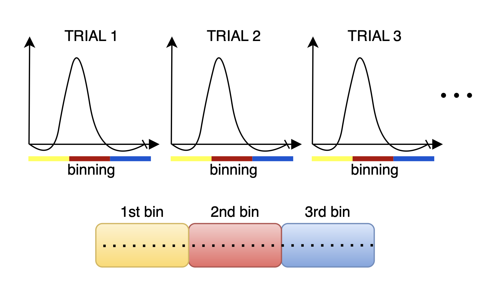

Binning: Flexible Readout Rearrangement
=======================================

In this section, we discuss how to flexibly partition readouts into several groups (or bins) to select which ones will contribute to each reconstructed image frame. 
This operation is often called "binning". In addition to the partitioning, we also include the exclusion of some data-lines, if needed, as part of the binning operation. 

There are many possible ways to rearrange the measurements, depending on the goal of the study. Here, we present some examples to showcase the flexibility of this framework.

Monalisa requires the binning to be a logical array of size `nBins x nLines`, where the element `cMask(i, j)` is true if we want to include the spoke number `j` in the `i-th` output image generation. `nLines` is the total number of sampled spokes.

First Example: Sequential Binning
----------------------------------

Sequential binning is one of the simplest ways to arrange data, where the data is grouped based on time. This method is particularly useful for imaging modalities that depend on temporal dynamics, such as resting-state fMRI, where we want to monitor the timecourse of the BOLD signal across brain regions. In sequential binning, we generate a sequence of images by grouping data into fixed temporal windows.

.. image:: ../images/sequential_binning.png
   :width: 90%
   :align: center
   :alt: Sequential binning groups data based on time.

For this example, we assume the unit of time is milliseconds, and that we want to produce a temporal sequence of images, each one containing data acquired over a period of 2 seconds.

### Steps for Sequential Binning:

1. **Initialize and Set Parameters**:
   Start by configuring the temporal window size and extracting metadata from the acquisition parameters. The `RawDataReader` object provides the necessary data for binning, such as the number of measures, the number of segments per shot (`nseg`), and timestamps for each readout.

   .. code-block:: matlab

      % Set temporal window size
      temporalWindowSec = 2;
      
      % Extract parameters from acquisition
      acquisitionParams = reader.acquisitionParams;
      nMeasures = acquisitionParams.nLine;
      nseg = acquisitionParams.nSeg;
      nShotOff = acquisitionParams.nShot_off;

2. **Adjust and Scale Timestamps**:
   The timestamps from the acquisition are adjusted to remove non-steady-state measurements, which are not used for image reconstruction. These timestamps are converted into milliseconds for easier manipulation.

   .. code-block:: matlab

      % Adjust timestamps and scale to milliseconds
      costTime = 2.5;  % Siemens-specific constant
      timeStamp = double(acquisitionParams.timestamp);
      timeStamp = timeStamp - min(timeStamp);
      timestampMs = timeStamp * costTime;

3. **Determine the Number of Temporal Bins**:
   Based on the total duration of valid data, calculate how many temporal bins (masks) are needed. Each bin corresponds to a fixed duration (e.g., 2 seconds).

   .. code-block:: matlab

      % Calculate total duration and number of temporal bins (masks)
      totalDuration = endTime - startTime;
      temporalWindowMs = temporalWindowSec * 1000;
      nMasks = floor(totalDuration / temporalWindowMs);

4. **Create and Assign Bins**:
   For each temporal bin, identify the corresponding measurements based on their timestamps. The binning masks (`cMask`) are initialized as logical arrays, where each bin corresponds to a set of measurements that occurred within the temporal window. SI projections (special measurements that should not contribute to image reconstruction) are excluded from each bin.

   .. code-block:: matlab

      % Initialize binning masks
      cMask = false(nMasks, nMeasures);

      % Populate the masks for each time window
      for i = 1:nMasks
          windowStart = startTime + (i-1) * temporalWindowMs;
          windowEnd = windowStart + temporalWindowMs;

          % Create mask for the current time window
          mask = (timestampMs >= windowStart) & (timestampMs < windowEnd);

          % Exclude SI projection for each segment
          for K = 0:floor(nMeasures / nseg)
              idx = 1 + K * nseg;
              if idx <= nMeasures
                  mask(idx) = false;
              end
          end

          % Assign the mask to the bin matrix
          cMask(i, :) = mask;
      end

The reconstructed images result from the contribution of each readout within the associated bin. In this case, the image represents the average BOLD signal over the 2-second interval corresponding to each bin.

Second Example: Task-Based (Hi-Fi) fMRI
----------------------------------------

This section discusses the binning process for task-based fMRI, which focuses on isolating the haemodynamic response to specific stimuli. By averaging multiple trials, this method effectively reduces the contributions of temporally uncorrelated brain activity, resulting in a clearer signal.

For instance, in a visual stimulation study, delayed activation in the brain's visual processing regions can be captured without assumptions about the shape of the haemodynamic response. This is done by combining readouts from several trials and reconstruct images that reflect the average response across trials, minimizing the effect of noise from activations that are uncorrelated with the stimulation.

To implement this binning strategy, we generate a logical array, `cMask`, of size `nBins x nMeasures`, where `cMask(i, j)` is true if the j-th measurement corresponds to the i-th bin. The number of bins is determined by the total duration of the trial and the temporal resolution for the haemodynamic response.

### Steps to Achieve the Goal:

1. **Initialize and Set Parameters**:
   
   We extract parameters from the `RawDataReader` object, which include the number of measurements, segments, and the number of shots to exclude. This information is vital for creating the mask and ensuring accurate binning.

   .. code-block:: matlab

      acquisitionParams = reader.acquisitionParams;
      nMeasures   = acquisitionParams.nLine;
      nseg        = acquisitionParams.nSeg;
      nShotOff    = acquisitionParams.nShot_off;

2. **Calculate Timestamps:**

   Normalizing the timestamps allows us to accurately track the timing of each measurement in milliseconds. This is essential for defining the intervals for each bin.

   .. code-block:: matlab

      costTime = 2.5;  % This is not magic; it's Siemens-dependent; do not change
      timeStamp = double(acquisitionParams.timestamp);
      timeStamp = timeStamp - min(timeStamp);
      timestampMs = timeStamp * costTime;

3. **Determine Number of Bins:**

   Based on the total duration of the trial and the specified temporal resolution, we calculate the number of bins required for the analysis. This is essential for structuring the `cMask` array correctly.

   .. code-block:: matlab

      totalDuration = endTime - startTime;  % Define start and end times appropriately
      nMasks = floor(totalDuration / (trialDurationSec / temporalResolutionSec));

4. **Initialize the Mask Matrix:**

   Create a logical mask matrix initialized to `false`, which will be populated with `true` values indicating the measurements belonging to each bin.

   .. code-block:: matlab

      cMask = false(nMasks, nMeasures);

5. **Populate the Bin Masks:**

   For each bin, we define the time window and create a mask that indicates which measurements fall within that window. We also exclude specific measurements corresponding to SI projections to enhance the quality of the data.

   .. code-block:: matlab

      for i = 1:nMasks
          % Define the start and end of the current trial
          windowStart = startTime + (i-1) * (trialDurationSec / temporalResolutionSec) * 1000; % Convert to ms
          windowEnd = windowStart + (trialDurationSec / temporalResolutionSec) * 1000;
          
          % Create the mask for the current trial
          mask = (timestampMs >= windowStart) & (timestampMs < windowEnd);

          % Assign the mask to the cMask matrix
          cMask(i, :) = mask;
      end

The resulting `cMask` will allow for the reconstruction of images that reflect the average haemodynamic response across trials, facilitating more accurate analysis of brain activation during task-based fMRI studies.

Third Example: Motion-Resolved Heart MRI
-----------------------------------------

A third example is binning using a physiological signal, such as heartbeats. The goal is to split the cardiac cycle into several sequential steps, called cardiac phases, and generate one image per phase. The assumption is that heart motion is cyclical, and by grouping data acquired at similar cardiac positions within each bin, we can reduce motion artifacts.

Steps to achieve the goal:

1. **Compute the initial time not in steady state (nshotoff).** For radial acquisition, the SI projection helps determine `nshotoff`.

2. **Extract the physiological signal using a navigator (SI).**

3. **Assign each point to the correct bin.**

