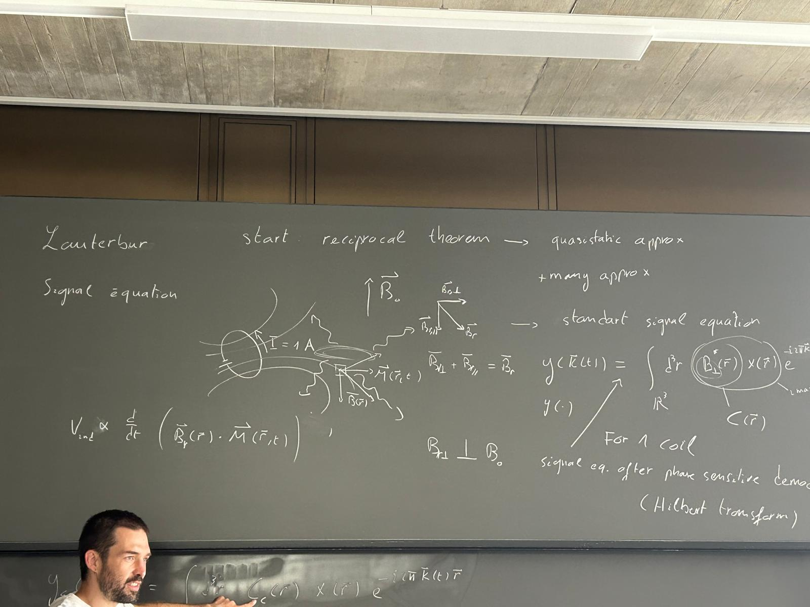

.. Monalisa documentation master file, created by
   sphinx-quickstart on Thu Jul 18 11:32:19 2024.
   You can adapt this file completely to your liking, but it should at least
   contain the root `toctree` directive.

====================================
Welcome to Monalisa's documentation!
====================================

First of all, why should you use Monalisa?

1. **Monalisa targets non-Cartesian reconstructions, motion-resolved/motion-corrected reconstructions, and partial Cartesian reconstructions.**  
   It offers great tools especially for radial imaging and motion-resolved/motion-corrected reconstructions. These are the best use cases for the current toolbox.

2. **Monalisa is easy to install and well documented** – as you can see!

3. **Monalisa is great for learning non-Cartesian iterative reconstruction methods.**

Here you can see a simplified schematic of the pipeline in Monalisa. Information from the acquisition raw data files is processed through multiple stages, together with additional information, such as the trajectory, volume elements, and user-defined binning and reconstruction parameters. Colored blocks indicate the degree of user control: red denotes acquisition-specific steps that are fixed and cannot be modified after acquisition; yellow highlights configurable steps that are rarely changed but can be customized or improved; green represents user-defined steps that must be adapted for each reconstruction. Initially, the workflow defines binning masks alongside coil sensitivity estimation and volume element computation. This is followed by the mitosius preparation, and finally, image reconstruction. The sections below are explaining each step extensively. Need more help? Consider opening a GitHub issue on our repository.

.. toctree::
   :maxdepth: 3
   :glob:
   :includehidden:

   1_quick_start
   2_contents
   3_examples

.. toctree::
   :maxdepth: 1
   :glob:
   :includehidden:

   4_api

.. toctree::
   :maxdepth: 3
   :glob:
   :includehidden:

   5_docker
   6_ack_contribution
   7_discussions

.. Indices and tables
.. ==================

.. * :ref:`genindex`
.. * :ref:`modindex`
.. * :ref:`search`
