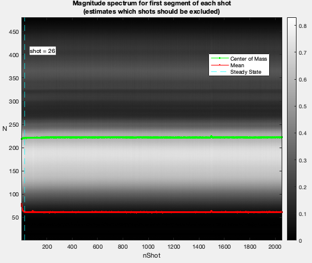
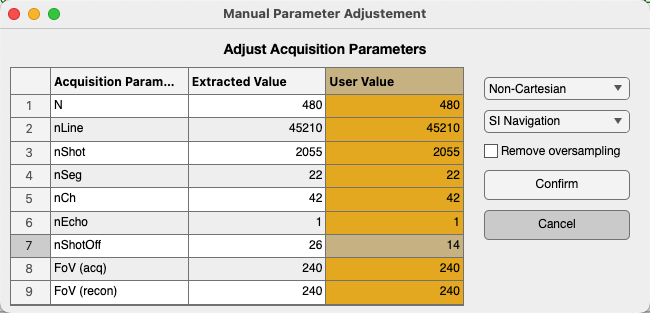
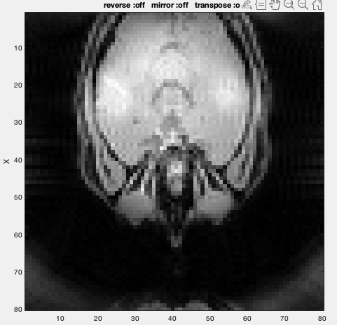
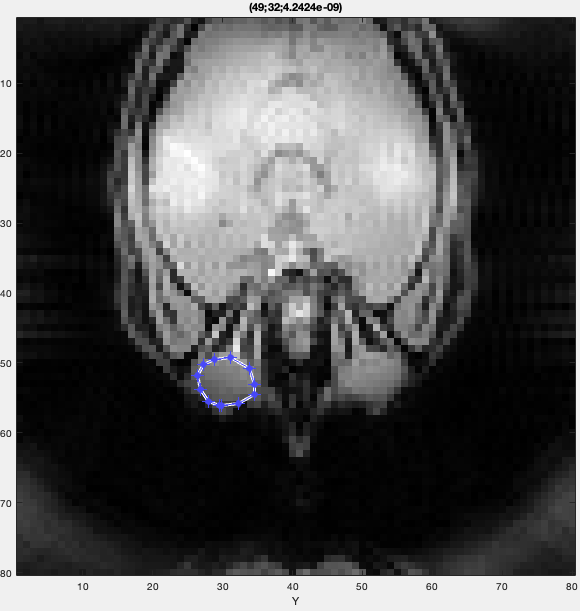

Mitosius: Prepare Your Data for Reconstruction
==============================================

Creating the Mitosius is the last preparation step before the reconstruction. This section covers how to prepare the mitosius.

You have already run the coil sensitivity estimation or had an estimate of coil sensitivity and masked coil sensitivity (see the :doc:`Coil Sensitivity Map Estimation <coil_sensitivity_map>`). You need to have access to the raw data of the acquisition (of course :) ).

This script is designed to process Siemens raw MRI data/ISMRMRD using various monalisa functions. The script performs several operations, including loading raw data, initializing parameters, computing trajectory points and volume elements, normalizing the data, and generating the output "mitosius". The mitosius contains raw data, the computed trajectory and the volume elements for each bin.

Keep in mind that the trajectory must be supported by the toolbox; alternatively, you can define and implement a custom trajectory following our suggestion at the end of the section (see the section :ref:`Using a Custom Acquisition Trajectory <custom_acquisition>`).

Prerequisites
-------------
Ensure you have the following files and paths correctly set up:

- Siemens raw data file. (Or ISMRMRD file)
- Precomputed coil sensitivity matrix (C.mat).
- Precomputed binning mask (Mask.mat)

Additionally, the required functions (e.g., `bmTwix_info`, `bmTwix`, `bmTraj`, etc.) should be available in your MATLAB environment, as these functions are internal functions in the monalisa toolkit.

A tip: you can use `bmTwix_info` function to help you inspect acquisition parameters by `bmTwix_info('/path/to/raw_data.dat')`. `bmTwix_info` is only a help function which is not part of the recon procedure. Sometimes, `bmTwix_info` may fail to read the raw data file. But there is no need to worry-you can still find your way to identify acquisition parameters.

Usage instructions
------------------

Define the Paths
~~~~~~~~~~~~~~~~

.. code-block:: matlab

    %% Paths - Replace for your own case
    f = '/your/path/to/raw_data/rawdata.dat';
    CMatPath = '/your/path/to/C/C.mat';
    MaskPath = '/your/path/to/Mask/Mask.mat';
    mitosiusPath = '/your/path/to/save/mitosius/';

Load the Raw Data
~~~~~~~~~~~~~~~~~

.. code-block:: matlab

    autoFlag = false;      % Set whether the validation UI is shown
    % Create the appropriate reader based on the file extension
    reader = createRawDataReader(f, autoFlag);

The raw data reader will check the first segment of each shot and estimate the steady state to determine the shots that should be excluded.
(The image title is yet to change)

The acquisition parameters will be extracted automatically, if possible.

You can also modify the parameters manually in the "User Value" column (in yellow), for example: adjusting `nShotOff` according to your needs. Then click the "Confirm" button.

Add MRI Acquisition Parameters
~~~~~~~~~~~~~~~~~~~~~~~~~~~~~~~

Save the acquisition parameters into `p` and add other parameters you may need.

.. code-block:: matlab

    p = reader.acquisitionParams;
    p.selfNav_flag = true;
    p.traj_type = 'full_radial3_phylotaxis';

    % Initialize and fill in the parameters:
    % p.raw_N_u: acquisition matrix size (identified from your acquisition protocol)
    p.raw_N_u         = [480, 480, 480]; % optional, just for records
    p.raw_dK_u        = [1, 1, 1]./480; % optional, just for records

Read the raw data and compute trajectory points, volume elements
~~~~~~~~~~~~~~~~~~~~~~~~~~~~~~~~~~~~~~~~~~~~~~~~~~~~~~~~~~~~~~~~

.. code-block:: matlab

    % Read raw data
    % get raw data without nshotoff and SI
    flagSS = true
    flagExcludeSI = true
    % flagSS: if true, filter out the non steady state shots (obj.acquisitionParams.nShot_off)
    % flagExcludeSI: if true, filter out the SI projections 
    y_tot = reader.readRawData(flagSS, flagExcludeSI);

    % compute trajectory points
    t_tot = bmTraj(p); % get 'full_radial3_phylotaxis' trajectory without nshotoff and SI
    % alternatively you can compute your own trajectory
    % more details in "Using a Custom Acquisition Trajectory"

    % compute volume elements
    ve_tot  = bmVolumeElement(t_tot, 'voronoi_full_radial3');

Load the Coil Sensitivity Matrix
~~~~~~~~~~~~~~~~~~~~~~~~~~~~~~~~

Resize the coil sensitivity matrix to match the reconstruction matrix size.
Here we want to clarify the distinction of the concepts between "Reconstruction matrix size" and "Acquisition matrix size"

- Acquisition matrix size: This refers to the matrix size specified by the acquisition protocol. It was already set at the acquisition step by the experimenters. For example, if Fov is 240mm, the acquisition matrix size equal to 480, we can calculate `voxel_size = Fov/Acquisition_matrix_size`

- Reconstruction matrix size `Matrix_size`: This is set by the user based on the desired resolution of reconstructed images, i.e. the size of the reconstructed image. 

- N_u: The size of reconstruction grid in Fourier space. For example, we can set `N_u = Matrix_size`.

    - :math:`N_u = [N_x, N_y, N_z]` 

- n_u: The size of reconstruction in image space. It is possible to be determined as `n_u ≤ N_u`. We recommend setting `n_u = N_u` for achieving the optimal image quality.

    - :math:`n_u = [n_x, n_y, n_z]` 

- dK_u: The step size of the grids in Fourier space, calculated as `dK_u = 1/Fov`.
    - :math:`dK_u = [dK_x, dK_y, dK_z]` 

.. code-block:: matlab

    load(CMatPath);
    % n_u: reconstruction matrix size
    C = bmImResize(C, [48, 48, 48], [N_u, N_u, N_u]);

Normalize the data
~~~~~~~~~~~~~~~~~~

Normalize the raw data by the average value of a region of interest (ROI). The goal is to adjust the intensity values of the image so that they are centered around a mean of 1 in the ROI.

Keep in mind that whether or not normalization is applied, the regularization weight in the final reconstruction step should be adjusted accordingly. Our normalization helps to standardize the regularization weight.

.. code-block:: matlab

    x_tot = bmMathilda(y_tot, t_tot, ve_tot, C, N_u, n_u, dK_u);
    bmImage(x_tot);
    temp_im = getimage(gca);
    bmImage(temp_im);
    temp_roi = roipoly;
    

Here an images of reconstruction estimation will be shown and you can select the ROI based on it. 

We selected the left eye globe as the ROI in our example below, you can also select yours with a larger area in the brain. 

- Left Click: Adds a vertex at the clicked position.
- Right Click/Double Click: Completes the polygon and closes it automatically.

.. code-block:: matlab

    normalize_val = mean(temp_im(temp_roi(:)));
    % normalize it only once
    y_tot = y_tot / normalize_val;

Cleaning of the mask
~~~~~~~~~~~~~~~~~~~~~
For some trajectories, such as the 3D radial trajectory, it is necessary to clean the SI projection and remove the first unsteady shots from the acquired readouts. Therefore, we also need to clean the binning mask accordingly to ensure that the size of `Mask` matches the size of `y_tot`.

.. code-block:: matlab

    load(MaskPath);
    Mask = reshape(Mask, [20, 22, 2055]);
    % before cleaning, the size of Mask: [nBin, nSeg, nShot]
    Mask(:, 1, :) = [];
    Mask(:, :, 1:p.nShot_off) = [];
    % after cleaning, the size of Mask: [nBin, nSeg-1, nShot-p.nShot_off]
    Mask = bmPointReshape(Mask);
    % after the reshape, the size of Mask: [nBin, nLines], where nLines=(nSeg-1)*(nShot-p.nShot_off)

Compute Final Data Structures for Reconstruction
~~~~~~~~~~~~~~~~~~~~~~~~~~~~~~~~~~~~~~~~~~~~~~~~

Run the `bmMitosis` function and compute the final volume elements.

.. code-block:: matlab

    [y, t] = bmMitosis(y_tot, t_tot, Mask);
    y = bmPermuteToCol(y);
    ve = bmVolumeElement(t, 'voronoi_full_radial3');

Save the Results
~~~~~~~~~~~~~~~~

Save the computed data structures to disk. These will be used for the final reconstruction.

.. code-block:: matlab

    bmMitosius_create(mitosiusPath, y, t, ve);

Notes
-----

- Ensure all paths are correctly set according to your system.
- If you encounter issues with function calls (e.g., `bmTwix`, `bmTraj`), verify that the necessary scripts or external toolboxes are added to the MATLAB path.
- The raw data normalization step ensures that the average value in the selected ROI ranges around the mean of 1 in the reconstructed images. This allows the standardization of the regularization weights.

.. _custom_acquisition:

Using a Custom Acquisition Trajectory
-------------------------------------

Still to do: Discuss how to use a custom trajectory & test it.
