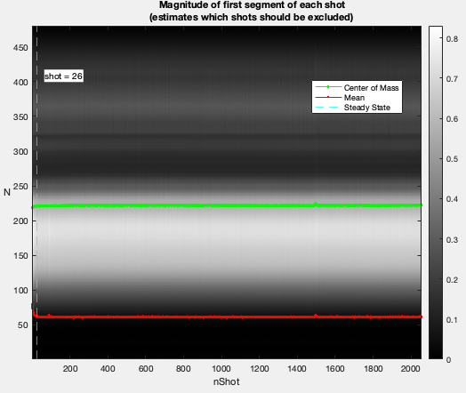

Mitosius: Prepare Your Data for Reconstruction
=============================================

Preparing Mitosius is the last fundamental step before the reconstruction.This section covers how to prepare your data for the mitosius step and run it.

You already need to run the coil sensitivity estimation or have an estimate of coil sensitivity and masked coil sensitivity. You need to have access to the raw data of the acquisition (of course :) ).

This script is designed to process Siemens raw MRI data/ISMRM using various monalisa functions. The script performs several operations, including loading raw data, initializing parameters, computing trajectory points and volume elements, normalizing the data, and generating the data ready for the reconstruction called "mitosius".

Keep in mind that the trajectory must be supported by the toolbox; alternatively, you can define and implement a custom trajectory.

Prerequisites
-------------
Ensure you have the following files and paths correctly set up:

- Siemens raw data file. (Or ISMRM file)
- Precomputed coil sensitivity matrix (C.mat).
- Precomputed binning mask (Mask.mat)

Additionally, the required functions (e.g., `bmTwix_info`, `bmTwix`, `bmTraj`, etc.) should be available in your MATLAB environment, as these functions are internal functions in the monalisa toolkit.

Usage instructions
------------------

Define the Paths
~~~~~~~~~~~~~~~~

.. code-block:: matlab

    %% Paths - Replace for your own case
    f = '/your/path/to/raw_data/rawdata.dat';
    CMatPath = '/your/path/to/C/C.mat';
    MaskPath = '/your/path/to/Mask/Mask.mat';
    mitosiusPath = '/your/path/to/save/mitosius/';

Load the Raw Data
~~~~~~~~~~~~~~~~~

.. code-block:: matlab

    autoFlag = false;      % Set whether the validation UI is shown
    % Create the appropriate reader based on the file extension
    reader = createRawDataReader(f, autoFlag);

The raw data reader will check the first segment of each shot and estimate the steady state to determine the shots that should be excluded.

The acquisition parameters will be extracted automatically.

You can also modify the parameters manually in the "User Value" column (in yellow), for example: adjusting `nShotOff` according to your needs. Then click the "Confirm" button.

Add MRI Acquisition Parameters
~~~~~~~~~~~~~~~~~~~~~~~~~~~~~~~

Save the acquisition parameters into `p` and add other parameters.

.. code-block:: matlab

    p = reader.acquisitionParams;
    p.selfNav_flag = true;
    p.traj_type = 'full_radial3_phylotaxis';

    % Initialize and fill in the parameters:
    % p.raw_N_u : Matrix size for reconstruction
    p.raw_N_u         = [480, 480, 480];
    p.raw_dK_u        = [1, 1, 1]./480;

Read the raw data and compute trajectory points, volume elements
~~~~~~~~~~~~~~~~~~~~~~~~~~~~~~~~~~~~~~~~~~~~~~~~~~~~~~~~~~~~~~~~

.. code-block:: matlab

    % Read raw data
    % get raw data without nshotoff and SI
    y_tot = reader.readRawData(true, true);

    % compute trajectory points
    t_tot = bmTraj(p); % get trajectory without nshotoff and SI
    % compute volume elements
    ve_tot  = bmVolumeElement(t_tot, 'voronoi_full_radial3');

Load the Coil Sensitivity Matrix
~~~~~~~~~~~~~~~~~~~~~~~~~~~~~~~~

Resize the coil sensitivity matrix to match the desired dimensions.

.. code-block:: matlab

    load(CMatPath);
    C = bmImResize(C, [48, 48, 48], [480, 480, 480]/2);

Normalize the data
~~~~~~~~~~~~~~~~~~

Normalize the raw data by selecting the average value of the region of interest (ROI).

.. code-block:: matlab

    x_tot = bmMathilda(y_tot, t_tot, ve_tot, C, [480, 480, 480]/2, [480, 480, 480]/2, [1, 1, 1]./480);
    bmImage(x_tot);
    temp_im = getimage(gca);
    bmImage(temp_im);
    temp_roi = roipoly;
    

Here an images of reconstruction estimation will be shown and you can select the ROI based on it. 

.. image:: ../images/mitosius/select_roi.png

We selected the left eye globe as the ROI in our example below.

- Left Click: Adds a vertex at the clicked position.
- Right Click/Double Click: Completes the polygon and closes it automatically.

.. image:: ../images/mitosius/select_roi_2.png

.. code-block:: matlab

    normalize_val = mean(temp_im(temp_roi(:)));
    % normalize it only once
    y_tot = y_tot / normalize_val;

Load the binning mask
~~~~~~~~~~~~~~~~~~~~~

.. code-block:: matlab

    load(MaskPath);
    Mask = reshape(Mask, [20, 22, 2055]);
    Mask(:, 1, :) = [];
    Mask(:, :, 1:p.nShot_off) = [];
    Mask = bmPointReshape(Mask);

Compute Final Data Structures for Reconstruction
~~~~~~~~~~~~~~~~~~~~~~~~~~~~~~~~~~~~~~~~~~~~~~~~

Run the mitosius function and compute the final volume elements.

.. code-block:: matlab

    [y, t] = bmMitosis(y_tot, t_tot, Mask);
    y = bmPermuteToCol(y);
    ve = bmVolumeElement(t, 'voronoi_full_radial3');

Save the Results
~~~~~~~~~~~~~~~~

Save the computed data structures to disk. These will be used for the final reconstruction.

.. code-block:: matlab

    bmMitosius_create(mitosiusPath, y, t, ve);

Notes
-----

- Ensure all paths are correctly set according to your system.
- If you encounter issues with function calls (e.g., `bmTwix`, `bmTraj`), verify that the necessary scripts or external toolboxes are added to the MATLAB path.
- The raw data normalization step ensures better convergence during image reconstruction.

Using a Custom Acquisition Trajectory
-------------------------------------

Still to do: Discuss how to use a custom trajectory & test it.
