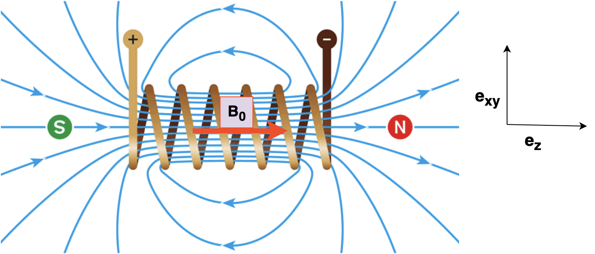
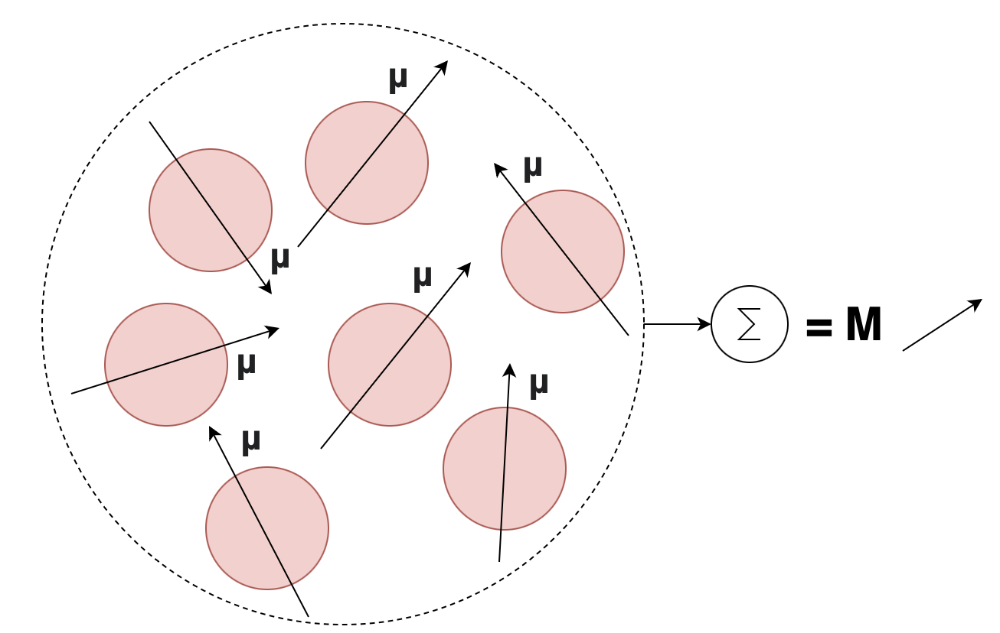
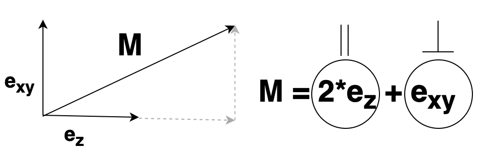
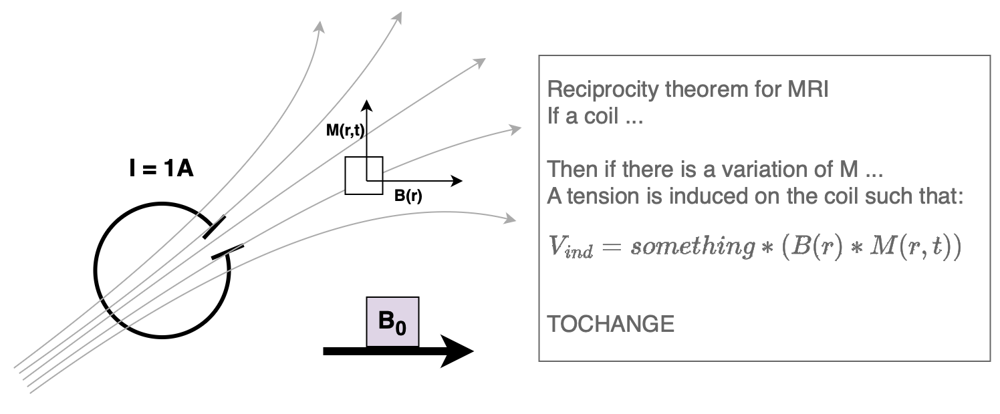

==================================================
Theory and Algorithms of the Monalisa Framework
==================================================

.. contents::
   :local:

Introduction
============

The Monalisa framework is designed for image reconstruction in Magnetic Resonance Imaging (MRI) using advanced techniques such as the Discrete Fourier Transform (DFT) and Non-Uniform Fast Fourier Transform (NUFFT). This document provides a theoretical overview of the principles behind these techniques and how they are implemented within the framework.

Basic Concepts and Notation
============================

**Magnetic Fields and Voxel Interaction**

A coil carrying current generates a magnetic field.

The MRI scanner among other component, it's mainly made by a big solenoid generating a static magnetic field $B_0$ (e.g: 3 Tesla). In Cartesian coordinates, we often assume that $B_0$ is in the directon of the z axis. When an object, such as a human body, is placed in this field, each "voxel" (a small volume element) within the body interacts with the magnetic field. Each voxel behaves like a small magnet and carry it's magnetization vector. The sum of all the magnetization is called net magnetization vector.

**Orthogonal decomposition**

Each vector can be decomposed into two orthogonal components (two subvectors) such that :math:`V = V_{\parallel} + V_{\perp}`, where :math:`V_{\parallel}` is parallel to the external magnetic field $B_0$. In Cartesian coordinates, this can be expressed as :math:`V_{\perp} = a*e_x + b*e_y`.

.. math::

   V = V_{\parallel} + V_{\perp}

Taking the example above, any net magnetization vector can be decomposed in it's two component, one parallel to $B_0$, one orthogonal to $B_0$.

Lauterbur Signal Equation
=========================

The starting point for MRI signal generation is the reciprocal theoreom:

The reciprocal theorem states that if a coil is in the situation of the scanner, e.g: is in a static magnetic field $B_0$ where each voxel has a magnetization M, then there is an induced current in the coil $V_{ind}$

.. math::

   V_{ind} \propto (B(r) \cdot M(r,t))

When an RF pulse is applied, it tips the magnetization $M$ away from equilibrium along $B_0$. The transverse magnetization induces a voltage in the coil. The coil sensitivity is the transverse component of the received magnetic field $B_r$, taken as its complex conjugate to ensure proper phase alignment during demodulation.

After a quasi-static approximation among other simplifications. The signal equation after demodulation is given by:

.. math::

    y(k, t) = \int_{\mathbb{R}^3} d^3r \, B_{\perp}^*(r) x(r) e^{-i2\pi k(t) \cdot r} = \int_{\mathbb{R}^3} d^3r \, C(r) x(r) e^{-i2\pi k(t) \cdot r}

Where:

- $y(k, t)$: Signal in k-space domain, what is actually measured by a single coil.
- :math:`B_{\perp}^*(r) := C`: Coil sensitivity, which varies spatially. The further the coil is from a voxel, the less sensitive it is to the emitted signal.
- $x(r)$: Image representation (magnetization :math:`M_{\perp}`).

1. **Integration Over Space**: The integral sums up contributions from all small regions (voxels) throughout the 3D space. Here, $r$ is a position in this 3D space.

2. **Contribution from Each Voxel**: For each very small voxel at position $r$:

   - Its contribution to the measured signal is weigthed by the coil's sensitivity at that position, :math:`B_{\perp}^*(r)`.
   - The value from the voxel, $x(r)$, is modulated by a complex exponential term, :math:`e^{-i2\pi k(t) \cdot r}`. This term represents how the signal from the voxel is transformed in the frequency domain. The term :math:`e^{-i2\pi k(t) \cdot r}` can be interpreted as part of a Fourier transform process.

Hence the signal measured is the fourier transform of the Image weighted by the coil sensitivity (also named coil image).

Note however that in practice we measure the signal with many coils, each having a different coil sensitivity :math:`B_{\perp,c}^*(r) := C_c(r)`. Globally we obtain many coil images:

.. math::

    y(k, t)_c = \int_{\mathbb{R}^3} d^3r \, C_c(r) x(r) e^{-i2\pi k(t) \cdot r}

To retrieve the Image x(r) we need to estimate the coil sensitivities of each coil $C_c$ and then find the x(r) that best explain the observed values $y(k, t)_c$. 

Discrete Domain and DFT
=======================

In practical applications, we work with a discretized version of reality. Instead of continuous data, we can only measure a finite number of Fourier coefficients, :math:`y(k, t)`, at discrete time points :math:`t_1, t_2, \dots, t_N`. Our goal is to reconstruct the image :math:`x(.)`, which is represented as a set of pixel values—a discrete approximation of the continuous function :math:`x(r)` at specific locations :math:`r_1, r_2, \dots, r_N`. In this discrete setting, the integral over :math:`\mathbb{R}^3` is replaced by a sum over the discrete locations :math:`r_i`.
Hence the signal measured by coil $c$ becomes:

.. math::

    y_c(k, t) = \sum_{i=1}^{N} \Delta R \, C_c(r_i) x(r_i) e^{-i2\pi K_k \cdot r_i}

Where:

- $C_c(r)$: Coil sensitivity matrix.
- $x(r)$: Spin density distribution.
- $K_k$: k-space vector.
- :math:`\Delta R`: Volume of the dicrete voxels.

Matrix Formulation
==================
**1. Voxel Representation**

Let's consider the locations :math:`\vec{r_i}`, where :math:`i = 1, \dots, N`, represent the number of voxels. As seen previously these are the location of the image pixels, hence they are on a cartesian grid.

**2. Image Representation**

The image can be represented by the vector :math:`\vec{X_i} = X(\vec{r_i}) \rightarrow \begin{pmatrix} x_1 \\ \vdots \\ x_n \end{pmatrix}`

**3. Definition of the coil sensitivity Matrix**

:math:`C_c(r)` is a diagonal matrix that contains the coil sensitivities at :math:`\vec{r_i}`.

The matrix :math:`C_c` is defined as:

.. math::

   C_c = \begin{pmatrix} C_c(\vec{r_1}) & 0 & \dots & 0 \\ 
                         0 & C_c(\vec{r_2}) & \dots & 0 \\ 
                         \vdots & \vdots & \ddots & \vdots \\ 
                         0 & 0 & \dots & C_c(\vec{r_n}) \end{pmatrix}

The product :math:`C_c(\vec{r_i}) \cdot X(\vec{r_i})` is denoted as :math:`(C_c X)_i`.

For one coil, the image recorded can be seen as:

.. math::

   X_c = C_c * x_{ref}

But as the true image :math:`x_{ref}` is not accessible, an estimation has to be made. 
The body coil of the MRI scanner are large and far from the region of interest (ROI), which allows for the assumption that inside the ROI, their coil sensitivity is constant.
Hence:

.. math::

   X_{body} = k \cdot x_{ref}

   x_{ref} = \frac{X_{body}}{k}

Given the assumption, and disregarding the factor `k` using normalization, the coil sensitivity can be estimated:

.. math::

   \begin{gather*}
   X_c = C_c * x_{ref} \approx C_c * \frac{X_{body}}{k} \\
   C_c \approx \frac{X_c}{X_{body}}
   \end{gather*}

**4. Fourier Transform, DFT & FFT**

The Fourier Transform is a mathematical operation that transforms a signal from its original domain (often time or space) into the frequency domain. This is fundamental in MRI, as the signal measured in k-space is the Fourier transform of the image.

For continuous functions, the Fourier Transform is defined as:

.. math::

   \tilde{X}(k) = \int_{\mathbb{R}^n} X(r) e^{-i 2\pi k \cdot r} \, dr

where:
- :math:`\tilde{X}(k)` is the Fourier transform of :math:`X(r)`,
- :math:`k` is the frequency vector,
- :math:`r` is the spatial coordinate vector.

In practice, we deal with discrete data points, so we use the Discrete Fourier Transform (DFT).

**Discrete Fourier Transform (DFT)**

The DFT is the discrete analog of the continuous Fourier Transform. For a set of discrete samples, the DFT is defined as:

.. math::

   \tilde{X}_k = \sum_{j=0}^{N-1} X_j \, e^{-i 2\pi k j / N}

where:

- :math:`\tilde{X}_k` is the DFT of :math:`X_j`,
- :math:`N` is the number of samples.

The DFT transforms a sequence of :math:`N` complex numbers into another sequence of :math:`N` complex numbers, representing the original data in the frequency domain. In our matrix formulation we have :math:`\tilde{F} = DFT(X(r))` and

.. math::

    F = \begin{pmatrix} \tilde{F} & 0 & \dots & 0 \\ 
                        0 & \tilde{F} & \dots & 0 \\ 
                        \vdots & \vdots & \ddots & \vdots \\ 
                        0 & 0 & \dots & \tilde{F} \end{pmatrix}

**Fast Fourier Transform (FFT)**

The Fast Fourier Transform (FFT) is an algorithm to compute the DFT efficiently. While a direct computation of the DFT requires :math:`O(N^2)` operations, the FFT reduces this to :math:`O(N \log N)` by exploiting symmetries in the DFT.

In MRI, the FFT is crucial for reconstructing images from the measured k-space data. The FFT enables us to efficiently transform the measured Fourier coefficients back into the spatial domain, reconstructing the image.

**5. Signal Approximation**

The signal :math:`y_{c,k}` is approximately given by:

.. math::

   y_{c,k} \approx \sum_{i=1}^{N} \Delta R \cdot (C_c X)_i \cdot e^{-i2\pi \vec{K_k} \cdot \vec{r_i}} 
   = \sum_{i=1}^{N} \Delta R \cdot e^{-i2\pi \vec{K_k} \cdot \vec{r_i}} \cdot (C_c X) = (\tilde{F} C_c X)_k

Here, :math:`\Delta R` represents the voxel volume and is part of the DFT.

**6. Discrete Signal Equation**

The full signal equation can be expressed as:

.. math::

   y_c = \tilde{F} C_c X

Where:

.. math::

   F = \begin{pmatrix} \tilde{F} & 0 & \dots & 0 \\ 
                       0 & \tilde{F} & \dots & 0 \\ 
                       \vdots & \vdots & \ddots & \vdots \\ 
                       0 & 0 & \dots & \tilde{F} \end{pmatrix}, 
   \quad C X = \begin{pmatrix} C_1 X_1 \\ \vdots \\ C_n X_n \end{pmatrix}, 
   \quad F C X = \begin{pmatrix} \tilde{F} C_1 X_1 \\ \vdots \\ \tilde{F} C_n X_n \end{pmatrix} 
   \approx \begin{pmatrix} y_1 \\ \vdots \\ y_n \end{pmatrix} = y

Thus, :math:`F C X \approx y` represents the discrete signal equation.

Gridding
=========

Applying DFT directly to non-Cartesian k-space is impractical due to the simplifications that are no longer valid. Instead, the following approach is used:

1. Evaluate the Fourier transform on a Cartesian k-grid using FFT.
2. "Interpolate" to the non-Cartesian grid using gridding on a virtual cartesian grid. 

The gridding process can be expressed as:

.. math::

   \{ h(\cdot) \ast Fz(\cdot) \}( \vec{k} ) \approx \sum_{\vec{k'} \in n \cdot B(\vec{k})} h(\| \vec{k'} - \vec{k} \|) Fz(\vec{k'}) \Delta k

We can limit the sum to the nearby points, without loosing much information, since the interpolation function is decreasing the influence of points that are far. A normal size of the interpolation grid is 3x3 closer points (right?).
We define h(.) the hat function as our interpolation function, that we don't specify to keep our discussion as general as possible.

The gridding is often missunderstood in many reconstruction implementation, leading to errors. Here we dig a bit more onto what is in our opinion the correct way to go about things.
For the gridding porcess we do a discrete convolution of the non uniform measures to estimate the fourier coefficients on the virtual cartesian grid locations. Using the properties of the discrete convolution:

.. math::

   \mathcal{F}\{z(\cdot)\}(\cdot) = \mathcal{F}\left(\frac{\mathcal{F}^{-1}\{h(\cdot)\} \ast z(\cdot)}{\mathcal{F}^{-1}\{h(\cdot)\}}\right)(\cdot)
   = \mathcal{F}\{\mathcal{F}^{-1}\{h(\cdot)\}\} \ast \mathcal{F}\left(\frac{z(\cdot)}{\mathcal{F}^{-1}\{h(\cdot)\}}\right)

   = h(\cdot) \ast \mathcal{F}\left(\frac{z(\cdot)}{\mathcal{F}^{-1}\{h(\cdot)\}}\right)
   = h(\cdot) \ast \mathcal{F}\left(k(\cdot)z(\cdot)\right)

The term :math:`\frac{1}{\mathcal{F}^{-1}\{h(\cdot)\}}` is often forgotten in implementations. We define  :math:`k(\cdot) := \frac{1}{\mathcal{F}^{-1}\{h(\cdot)\}}`.

We define :math:`G` as the gridding matrix, where:

.. math::
    G_{i,j} = \frac{h(k_i - k_j)}{\sum_{l} h_{i,l}}

    G_{u,t} = G_u^\text{T}

    G_u = N(W) \cdot W 

    G_n = N(W^\text{T}) \cdot W^\text{T} 

$G_u$ is the gridding from non-unifrom to uniform, while $G_n$ is the gridding from uniform to non-unifrom.

Reconstruction Algorithms
==========================

THEORY BEHIND THE VARIOUS RECONS;

1. Shanna

2. Mathilda

3. Nashamathilda

AND SO ON

SUMMARY OF THE IMPLEMENTED RECONS
====================================

JUST A DUMB TEMPLATE HERE

+----------------+-------------+---------------------+---------------------+
| Recon name     | K-space     | Compressed sensing  | Other columns       |
+================+=============+=====================+=====================+
| Shanna         | Uniform     | No                  | Alpha               |
+----------------+-------------+---------------------+---------------------+
| Mathilda       | Uniform     | yes                 | Beta                |
+----------------+-------------+---------------------+---------------------+
| Nashamathilda  | Non Uniform | yes                 | Gamma               |
+----------------+-------------+---------------------+---------------------+
